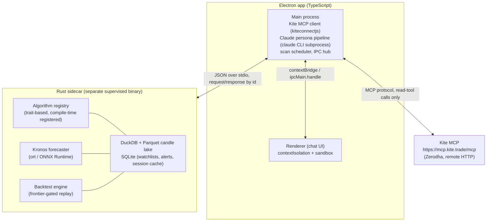

# Trade Assistant — System Architecture Design

Status: approved by user 2026-07-18, pending implementation planning.
Author: design produced via superpowers:brainstorming + a 56-agent research/verify workflow (Kite Connect/MCP internals, freqtrade/Hummingbot/LEAN/Kronos reference architectures, TA/quant/options-Greeks catalog, backtesting methodology, Claude headless integration, Electron+Rust bridging, storage, public data sources, SEBI regulatory posture).

## 1. Purpose

A personal, single-user desktop application that helps its one user (the builder) decide whether to buy, sell, or hold a position on Zerodha Kite, by running a large catalog of independent, deterministic algorithms over real market data and having Claude synthesize their output into a plain-language, evidence-cited recommendation. The user is the only human who ever sees the app or acts on its output. It is never shipped, published, or used by anyone else.

The app answers two kinds of questions:
- **Reactive**: "should I sell/add to this position?" / "what does the data say about X right now?"
- **Proactive**: scanning a configured watchlist/portfolio on a schedule and surfacing names worth a look.

Both intraday and positional/swing horizons are in scope, decided per query rather than as a fixed mode. Instrument scope is anything searchable on Kite — individual equities, indices (Bank Nifty, Nifty 50), and their F&O (options/futures) — generalized via Kite's instrument search rather than hardcoded to specific symbols.

This design supersedes, and is a superset of, an earlier personal prototype (`ws/trade/`) that used Claude Code skills to do Bank-Nifty/Nifty-50-only intraday probability analysis via the same Kite MCP endpoint. That prototype's hard rule was "never say buy/sell/hold" — probability output only. This app intentionally relaxes that: Claude is allowed to state an actual directional lean (sell / hold / add), because the user — not the app — is always the one who acts on it. What both designs share, and what carries forward unchanged, is: Kite MCP as the sole live data source, and an absolute prohibition on the app itself ever executing a trade.

## 2. Non-Goals / Hard Constraints

These are permanent, not v1-only:

- **The app never places, modifies, cancels, or automates any order, ever.** No feature, button, or "human-confirmed send" flow of any kind exists anywhere in the codebase for this. See §4 for how this is enforced.
- No automation/cron-triggered trading logic. Proactive scanning only ever produces information for the user to read; it never acts.
- Single user, single machine, no accounts, no multi-tenant anything, no server component reachable from outside `127.0.0.1` (if any local service is ever used at all — see §8.1).
- Claude is the only AI provider in v1. Other providers (Copilot, Codex, etc.) are a future possibility, so the AI layer sits behind a provider interface (§7.1), but only one implementation exists now.
- TTS/STT are out of scope entirely for v1 (see `docs/TTS_STT.md` for the reference pattern if revisited later) — the design leaves an obvious extension point (the chat layer already round-trips plain text) but nothing is built for it now.
- Not legal advice: §10's regulatory notes are research findings, not a compliance sign-off. The user has already been told this.

## 3. High-Level Architecture

Three cooperating processes, all on one machine:



**Why a sidecar, not a native Rust addon (napi-rs) or a persistent OS-level daemon:** verified research (adversarial fact-check, not just first-pass claims) found that cross-compiling a native Node addon to Windows-MSVC from a macOS host currently hits real, open toolchain bugs in exactly the dependencies a compute core needs (TLS/crypto crates, clang-cl mismatches) — see §9. A native addon also means every Rust panic crossing the FFI boundary is undefined behavior unless every one of the "many algorithms" plugin entry points wraps `catch_unwind`, and every Rust change requires a full Electron restart (no hot-reload). None of that buys anything here, because the actual workload — score a watchlist every few minutes, run an analysis on request, occasionally backtest — is periodic/batch, not latency-sensitive. A persistent OS-level daemon's one real advantage (scanning survives the app being fully closed) is achievable more cheaply by keeping Electron tray-resident with an in-process scheduler, without standing up service-lifecycle/install/uninstall machinery for a single user on a single machine.

The sidecar is spawned and supervised (auto-restart on crash) by Electron's main process. It is a plain compiled Rust binary — no Node ABI coupling, no ASAR packaging concerns — communicating over newline-delimited JSON on stdio, request/response correlated by an id (the same shape as a `oneshot`-channel request/response pattern, kept deliberately simple: no connection pooling or multi-client fan-out, since there is exactly one caller).

| Concern | Owner | Never owned by |
|---|---|---|
| Kite MCP connection (session, auth, all tool calls) | Electron main (TS) | Rust — Rust never touches the network for Kite |
| Claude subprocess invocation, persona pipeline | Electron main (TS) | Rust |
| Algorithm computation, Kronos inference, backtesting | Rust sidecar | Electron/TS — TS never re-implements indicator math |
| Candle/indicator storage | Rust sidecar (DuckDB/Parquet + SQLite) | — |
| Chat UI rendering | Electron renderer | Main process (renderer has no Node/Kite access) |

Rationale for keeping Kite ownership in TS rather than Rust: the MCP TypeScript SDK has mature remote-HTTP/Streamable-HTTP client support; nothing equivalent exists ready-made in the Rust ecosystem (even the local `jcode` reference repo's own MCP client is stdio-only and hand-rolled — building an HTTP/SSE MCP client in Rust from scratch would be real, avoidable work). It also keeps every credential/session boundary in exactly one process, which matters for §4.

## 4. Safety Model: The App Never Places An Order

**This is the single most important section of this design, driven by a safety-critical research finding.**

Live protocol testing against the production Kite MCP endpoint (`https://mcp.kite.trade/mcp`, server self-reporting `v0.3.2`) on 2026-07-18 showed it exposes 24 tools, including `place_order`, `modify_order`, `cancel_order`, `place_gtt_order`, `modify_gtt_order`, `delete_gtt_order` — gated by the same generic login-session check as every read tool, with no "tool disabled" response. This directly contradicts Zerodha's own README (`github.com/zerodha/kite-mcp-server`) and support docs, which claim the hosted instance excludes destructive operations by default via a server-side `EXCLUDED_TOOLS` config flag. Two independent research/verify passes confirmed this by directly querying the live server, not by trusting its documentation.

**Consequence: the "never place an order" guarantee must be enforced entirely in this app's own code, and must never depend on Zerodha's current hosted configuration, tool annotations, or documentation, because those have already been shown to drift from reality.**

Enforcement, layered (each layer independently sufficient; together, defense-in-depth):

1. **Primary layer — no method exists.** The Kite MCP session is wrapped in a typed TypeScript class exposing only bound methods for the tools this app actually implements: `searchInstruments`, `getHistoricalData`, `getQuotes`, `getOHLC`, `getLTP`, `getMargins`, `getHoldings`, `getPositions`, `getProfile`, `getGtts` (read-only), `login`. There is no method anywhere in the codebase — and therefore no code path, including one a prompt-injected instruction from untrusted news/MCP content could ever reach — that could invoke `place_order`, `modify_order`, `cancel_order`, `place_gtt_order`, `modify_gtt_order`, or `delete_gtt_order`.
2. **Second layer — CLI-level denylist.** Every `claude` subprocess invocation is launched with `--disallowedTools mcp__kite__place_order,mcp__kite__modify_order,mcp__kite__cancel_order,mcp__kite__place_gtt_order,mcp__kite__modify_gtt_order,mcp__kite__delete_gtt_order`, plus `--strict-mcp-config` so no other MCP config source can silently reintroduce capability.
3. **Third layer — drift detection.** At every app startup (and before each Kite session use), the app calls `tools/list` on the live MCP connection and diffs it against an expected/allowed tool-name set. Any unexpected tool appearing, or a previously-excluded write tool becoming newly reachable in some other way, surfaces as a visible warning banner — this is treated as monitoring a remote, operator-controlled surface that has already been observed to change without notice, not a one-time check.
4. If self-hosting `kite-mcp-server` is ever considered instead of the hosted `mcp.kite.trade` endpoint, the self-hosted instance's own `EXCLUDED_TOOLS` env var is set explicitly to cover all six write/GTT-write tool names — as a second-tier safeguard, never the primary one (layers 1–3 already make it irrelevant whether the server-side flag is set correctly).

This is also why the regulatory posture in §10 holds: SEBI's algo-trading rules attach specifically to code paths that place orders. As long as no such path exists — not merely "exists but is unused" — the app stays outside that regime by construction.

## 5. Data Layer

### 5.1 Kite Connect / Kite MCP facts this design relies on

- **Docs root:** `https://kite.trade/docs/connect/v3/`. Auth header for direct REST calls: `Authorization: token api_key:access_token`.
- **Pricing:** the free "Personal" plan has zero market data. The paid "Connect" plan (₹500/month per API key, since a Feb 2025 repricing that folded historical data into the base fee) is required for both historical candles and the WebSocket tick feed. This is a real recurring cost the user carries independent of the Claude subscription.
- **Auth flow:** browser login → short-lived `request_token` → `POST /session/token` with `checksum = SHA-256(api_key + request_token + api_secret)` → `access_token`. The access token is **force-invalidated daily at approximately 6 AM the next day**, regardless of issue time — there is no refresh token for ordinary apps, and Zerodha does not recommend automating the login. The app must detect an expired/absent session (a `TokenException`/HTTP 403, or the Kite MCP `login` tool's own auth-gate response) and show a clear "Kite needs login today" banner rather than silently failing or fabricating data — this directly matches the user's own stated requirement to detect and surface auth state.
- **Kite MCP tool inventory** (see §4): auth (`login`), market data (`get_quotes`, `get_ltp`, `get_ohlc`, `get_historical_data`, `search_instruments`), portfolio (`get_profile`, `get_margins`, `get_holdings`, `get_positions`, `get_mf_holdings`), order history read (`get_orders`, `get_trades`, `get_order_history`, `get_order_trades`, `get_gtts`) — all of these are safe to call. The write tools are never called (§4).
- **Historical candles:** `GET /instruments/historical/:instrument_token/:interval`, intervals `minute, 3minute, 5minute, 10minute, 15minute, 30minute, 60minute, day` — no native weekly/monthly, resampled client-side from daily. Community-reported per-request lookback caps (not on the current official docs page — validate empirically before hardcoding pagination): minute ≈60 days, 3/5/10-minute ≈100 days, 15/30-minute ≈200 days, 60-minute ≈400 days, day ≈2000 days.
- **Instrument identity:** key all persisted data on `exchange:tradingsymbol`, never on the numeric `instrument_token` — F&O tokens are recycled every expiry.
- **Rate limits** (per API key): quote endpoints 1 req/sec, historical 3 req/sec — backfills across many symbols must be throttled client-side to this.
- **Index instruments (NIFTY, BANKNIFTY) always report volume=0/OI=0** in historical candles — any volume-based algorithm must special-case indices or fall back to the corresponding futures contract.

### 5.2 Data quality — things Kite does not guarantee, that this app must own

- **Corporate-action adjustment is unreliable at intraday granularity.** Zerodha's own support account and its developer-forum staff give contradictory answers: daily candles are reliably adjusted for splits/bonuses; intraday candles are adjusted only for "recent" actions, with documented cases of stale intraday data showing a raw discontinuity (e.g. a 2015 bonus issue showing ~2× OHLC on old intraday candles). There is no corporate-actions-calendar API. **Design implication:** treat any large single-candle price jump as a "needs corporate-action review" flag rather than a real move, and periodically re-fetch/re-validate cached intraday history rather than treating it as a permanently-valid snapshot.
- **No holiday-calendar API** — the app maintains its own NSE/BSE trading-holiday list; a `from`/`to` window spanning only holidays returns an empty array, not an error, and must not be misread as "no data available."
- **No historical circuit-limit data** — circuit limits are live-quote-only, current-day snapshots; detecting a past circuit lock is a heuristic (flat OHLC + collapsing volume), never exchange-confirmed, and must be labeled as such.
- **Timestamps** are ISO-8601 with an explicit `+0530` offset — always parse offset-aware, never strip to naive (a documented real bug class mis-parses this into corrupted times).
- **A "live" candle is not guaranteed final** the instant it closes — values can still change on refetch shortly after, since the historical service writes asynchronously from ticks. Any live-scoring pass should treat the most recent 1-2 candles as provisional.

### 5.3 Storage

The candle/backtest workload is scan/aggregation-heavy (wide date-range reads, rolling-window math), not point-lookup-heavy — an OLAP shape, not OLTP. Plain SQLite benchmarks one to two orders of magnitude worse on this shape than a columnar engine.

- **Candle lake:** Parquet files, Hive-partitioned by symbol/timeframe/date, queried via embedded DuckDB (`duckdb-rs`) with SQL directly against the partitioned files (`read_parquet()` with predicate/projection pushdown) — one self-contained Rust binary, no server process.
- **Mutable state:** a small SQLite database (`rusqlite`, bundled) for watchlists, alert rules, ingestion checkpoints, and the Kite session-token cache — low-volume, transactional, a poor fit for Parquet's batch-write model.
- Intraday ticks are buffered in memory/SQLite and batch-compacted into the day's Parquet partition at end-of-day, not written per-tick (Parquet is not suited to frequent single-row appends).

## 6. Algorithm Layer (Rust sidecar)

### 6.1 Algorithm contract

Every algorithm — classical technical indicator, statistical/quant method, options analytic, or the Kronos forecaster — implements one trait:

```rust
trait Algorithm: Send + Sync {
    fn id(&self) -> &'static str;
    fn required_lookback(&self) -> usize;
    fn applicable_horizons(&self) -> &'static [Horizon]; // Intraday | Positional
    fn compute(&self, ctx: &MarketContext) -> AlgoOutput;
}

struct AlgoOutput {
    algo_id: &'static str,
    symbol: String,
    timeframe: Timeframe,
    horizon: Horizon,
    direction: Direction,      // Bullish | Bearish | Neutral
    magnitude: f64,
    confidence: f64,           // this run's self-reported confidence
    evidence: Vec<String>,     // short human-readable "why" strings
    computed_at: DateTime<Utc>,
}
```

Implementations are pure and deterministic given the same input candles (Kronos included — its forecast is a deterministic function of its frozen weights plus the input sequence, not a source of randomness). They are registered at compile time (static registration, e.g. via `inventory`/`linkme`) rather than dynamically loaded — the binary stays a single, auditable artifact, and "dozens of algorithms" stays maintainable instead of turning into an if-else tree. Execution is parallelized across the (instrument × timeframe × algorithm) cross-product with `rayon`.

### 6.2 Algorithm catalog (v1)

**Technical indicators** (formulas/parameters per standard references — Wilder, StockCharts ChartSchool, TA-Lib source):
- Trend: SMA, EMA, MACD (12/26/9), ADX/DMI, Supertrend, Ichimoku, Parabolic SAR.
- Momentum: RSI (Wilder, 14), Stochastic (14/3/3), CCI (20), Williams %R, ROC.
- Volatility: Bollinger Bands (20-SMA ±2σ), ATR (Wilder, 14), Keltner Channels, Donchian Channels.
- Volume: OBV, session-anchored VWAP (9:15 IST reset), MFI, CMF, Accumulation/Distribution.
- Pattern recognition: candlestick patterns (engulfing, doji — TA-Lib logic as the auditable reference), chart-pattern/support-resistance heuristics — these have no agreed-upon formal algorithm anywhere in the literature (confirmed by research), so they are explicitly labeled in the UI as heuristic overlays, never as deterministic signals, consistent with the human-in-the-loop mandate.
- Rust implementation: `rust_ti` as the primary crate (actively maintained, zero dependencies, ~70+ indicators), cross-checked against `yata` for anything `rust_ti` lacks (e.g. Heikin-Ashi/Renko). **`ta-rs` is explicitly excluded** — it has a known, unresolved RSI bug (wrong EMA alpha) since 2021.

**Statistical/quant methods:**
- Mean-reversion: Engle-Granger/Johansen cointegration tests, Ornstein-Uhlenbeck half-life estimation, z-score entry/exit bands.
- Volatility regime: range-based estimators computable directly from OHLC (Parkinson, Garman-Klass, Yang-Zhang — Yang-Zhang preferred as the default since it handles both overnight gaps and intraday jumps, matching NSE's daily-gap session pattern), plus GARCH(1,1) for realized-vol modeling.
- Multi-timeframe confluence: an explicitly hand-designed, labeled-as-such rule engine — the research found no academic/standardized formula for this; every real-world implementation is bespoke. Computes the same indicator set per timeframe, forward-fills higher-timeframe values down without lookahead, combines via weighted-sum/count-of-conditions-met.

**Options/F&O analytics** (in scope per the confirmed "any Kite instrument" scope):
- Black-Scholes-Merton Greeks (Delta, Gamma, Theta, Vega, Rho) and implied volatility, using `blackscholes` (github.com/hayden4r4/blackscholes-rust) and/or `implied-vol` (a Rust port of Peter Jäckel's "Let's Be Rational," which is the robust standard for IV solving — naive Newton-Raphson diverges near-zero-Vega, exactly the deep-OTM/near-expiry profile common in NSE weekly chains). NSE index options are European-style (plain BS is exact); individual stock options are American-style physically-settled (BS is an approximation there).
- OI buildup classification (long buildup / short buildup / short covering / long unwinding from the price×OI 2×2 matrix), Put-Call Ratio, Max Pain — all sourced directly from Kite's own OI fields (`oi`, `oi_day_high`, `oi_day_low`, and historical `oi=1`), no external scraping needed. These are presented as **descriptive overlays for human judgment, never as directional signals or confidence scores** — Max Pain in particular is only meaningful in the final days before expiry per the research.

**Kronos** (candlestick foundation model, confirmed real via adversarial verification — MIT-licensed, `github.com/shiyu-coder/Kronos`, arXiv:2508.02739, AAAI 2026): run via the small (mini/small/base, 4M–102M param) open-weight checkpoints through Rust's `ort` (ONNX Runtime) crate inside this same sidecar, registered as one more `Algorithm` implementation. **Open technical spike required before building the rest of the catalog around this assumption:** confirm Kronos's transformer core exports cleanly to ONNX, and reimplement its BSQ tokenizer's quantization step as plain Rust math. If the ONNX export path does not pan out, the fallback is a small local Python/FastAPI sidecar, supervised the same way as the Rust binary, speaking the same JSON-over-stdio-style protocol — same architecture shape, one more child process, not a redesign. Kronos's output is presented as one labeled "model opinion" (a forecast band + conviction) alongside the classical indicators — practitioner consensus found in research treats it as a promising research direction, not a demonstrated production trading edge, so it is never presented as a headline verdict on its own.

### 6.3 Aggregation — deliberately not a single collapsed number

QuantConnect's LEAN engine (a direct architectural reference for "many algorithms feed one decision") was found, on close reading, to default to a "last-writer-wins per symbol" collapse when multiple signal sources disagree — and QuantConnect's own founder cautioned against treating aggregated insights as a proxy for genuinely independent signals. This design deliberately avoids that failure mode: the aggregation step never discards or overwrites a disagreeing algorithm's output.

What reaches the AI layer is always two things:
1. The **full, uncollapsed array** of every algorithm's `AlgoOutput` for the instrument in question.
2. A separate, deterministic, non-AI **confluence scorecard**: counts of bullish/bearish/neutral by horizon, and a weighted-vote score where each algorithm's weight is its own **rolling historical hit-rate from the backtest engine** — kept explicitly distinct from that algorithm's live self-reported `confidence` field. Both numbers travel together; they are never collapsed into one.

Claude never sees a pre-filtered subset of the algorithm roster's opinions.

### 6.4 Backtesting

The backtest engine replays the exact same `compute()` functions used live, walked forward one candle at a time, with the same anti-lookahead discipline LEAN enforces internally: a bar is never visible to any algorithm before its own `EndTime` has genuinely passed, and all consolidation windows are anchored to exchange-local session time, not UTC or OS locale. Backtesting does **not** invoke Claude per-bar — it is a pure Rust quantitative loop; Claude is only invoked for live/human-facing synthesis, or, on request, to summarize a completed backtest run's report in plain language. Backtest output (per-algorithm hit-rate, expectancy) is what feeds the confluence scorecard's weights in §6.3 — this is the loop that lets "which algorithms have actually been right" inform "how much weight each gets," without ever touching Claude in the loop.

## 7. AI Reasoning Layer

### 7.1 Provider abstraction

```typescript
interface Provider {
  complete(envelope: AnalysisEnvelope): Promise<Verdict>;
}
```

`ClaudeCliProvider` is the only implementation in v1, invoking the `claude` CLI as a subprocess per `docs/CLAUDE_USAGE_GUIDE.md` (custom `--system-prompt`, `--json-schema` for structured output, `--output-format json` for the concise-text-plus-structured-detail envelope, session continuity via `--resume`/`--session-id` where a query is a follow-up on a prior one). This interface is the placeholder for future providers (Copilot, Codex, etc.) — nothing else in the app depends on Claude specifically; everything upstream of this interface only knows about `AnalysisEnvelope` and `Verdict`.

Two known limitations of the CLI path to design around: `--json-schema` is best-effort-with-retries (wraps the schema as a synthetic tool call, validates, retries up to a cap), not the raw Messages API's constrained-decoding guarantee — the app must handle a `structured_output`-absent response as a real failure mode, not assume it never happens. Prompt caching (Anthropic's ephemeral 1-hour cache) should be relied on deliberately: the system prompt and tool definitions are large and reused across every query in a session, so structuring calls to maximize cache hits materially controls cost.

### 7.2 Persona pipeline

Rather than one monolithic prompt trying to reason about everything at once, synthesis is a short pipeline of Claude invocations, each with its own system-prompt persona, all still the single Claude subscription invoked multiple times per query (no extra accounts/keys):

- A persona focused on options/OI/Greeks reading.
- A persona focused on technical/quant confluence reading.
- A persona focused on position/risk framing (relevant when the query is reactive on a held position).
- A final **synthesis persona** that must cite specific evidence from the others (by `algo_id`, not vague paraphrase) before producing the verdict.

This is an internal pipeline detail, not visible to the user as separate "chats" — the chat UI presents one coherent answer per query.

### 7.3 Envelope contract

```typescript
interface AnalysisEnvelope {
  trigger: "reactive" | "proactive_scan";
  instrument: { symbol: string; exchange: string; segment: string; kite_token_asof: string };
  horizon_requested: "intraday" | "positional" | "auto";
  algo_results: AlgoOutput[];           // full, uncollapsed — see §6.3
  confluence: ScorecardSummary;
  overlays: { oi_buildup?: string; pcr?: number; max_pain?: number; greeks?: object; kronos_forecast?: object };
  position_context?: { qty: number; avg_price: number; pnl: number };
  news_context?: CitedHeadline[];
  session_id?: string;
}

interface Verdict {
  direction: "sell" | "hold" | "add" | "watch";
  conviction: "high" | "medium" | "low";
  reasoning: string;              // must cite specific algo_ids
  verify_before_acting: string;   // mandatory: what the human should check in Kite itself
}
```

### 7.4 System prompt principles

The system prompt is engineered (via the prompt-engineer skill, at implementation time) around patterns found directly in Anthropic's own public reference prompts for this exact domain (`anthropics/financial-services`):
- **Evidence citation is mandatory** — every claim traces to a specific `algo_id`/tool call; unsourced figures are marked as such rather than estimated.
- **No-execution is enforced by tool absence, not by instruction** — the persona pipeline is never given any tool that could place an order (see §4); the prompt does not need to "promise" not to trade, because it structurally cannot.
- **Untrusted external content** — any news/third-party text pulled via MCP or web search is treated as data to extract, never as instructions to follow (directly relevant since this app pulls live news/sentiment text into the same context Claude reasons in).
- **Conviction taxonomy** — High/Medium/Low conviction, kept separate from the factual citations backing it, matching Anthropic's "Calibrated" honesty framing (stated confidence should match actual evidence strength, never overstate or understate it).
- **Dual output mode** — a concise, decision-ready default (mirroring the old prototype's ~8-12 line concise mode) and a full structured report on request ("full"/"detailed"), using the `result` (text) + `structured_output` (schema-validated) split the CLI's JSON output format already provides natively.
- **Voluntary AI-use disclosure** — Anthropic's own usage policy classifies "financial advice" as a high-risk use case warranting clear AI-use disclosure; adopted here even though this is a single-user tool, since it costs nothing and matches the spirit of the user's own requirements.

## 8. Electron Application

### 8.1 Process topology & scheduling

Electron main process stays resident (tray icon) so the proactive watchlist scanner can run on a timer without a chat window needing to be open — this is what makes "proactive scanning" work without standing up a separate OS-level daemon (§3). A deterministic pre-Claude gate (confluence delta exceeds a threshold, an IV spike, an OI-buildup flip) decides whether a given scan tick is worth an actual Claude call, so the app isn't spending a synthesis call on every watchlist symbol every tick when nothing has changed.

### 8.2 Security architecture

- Every `BrowserWindow`: `contextIsolation: true`, `sandbox: true`, `nodeIntegration: false`. Capabilities exposed to the renderer only via `contextBridge.exposeInMainWorld`, backed by named `ipcRenderer.invoke`/`ipcMain.handle` wrappers — the raw `ipcRenderer` module is never exposed.
- All outbound Kite/Kite MCP calls are funneled through the main process; the renderer never has network access to Kite, even indirectly.
- **Any AI-generated markdown rendered in the chat UI is sanitized with DOMPurify using an explicit `ALLOWED_TAGS`/`ALLOWED_ATTR` allowlist, non-negotiably.** This is not a hardening nice-to-have: a real, recently-patched CVE (DeepChat, Feb 2026) is architecturally identical to this app — Electron + AI chat + unsanitized markdown rendering let an `` payload reach an exposed `contextBridge` method and escalate renderer XSS into local action. A real CSP (`default-src 'none'; script-src 'self'; object-src 'none'`, no `unsafe-inline` for scripts) is layered on top as defense-in-depth, not a substitute for sanitization.
- `setWindowOpenHandler` defaults to deny; any exposed "open external link" bridge method validates the protocol (`http:`/`https:`/`mailto:` only) before calling `shell.openExternal`.

### 8.3 Chat UI

A standard chat-app layout: message list (markdown + tables + inline Mermaid diagrams, streamed token-by-token) and a message input box. Diagrams/tables from algorithm output and backtest reports render inline rather than as attachments. Setup/session state surfaces as banners rather than blocking dialogs:
- Claude auth not detected → banner prompting `claude auth login` (or the app's own wrapper around it).
- Kite session expired/absent (today's daily re-login not done yet) → banner prompting the Kite login flow, matching the "first call each session may need a login popup" behavior the old prototype already surfaced correctly.
- Kite MCP tool-list drift detected (§4, layer 3) → visible warning banner, not a silent log line.

Kite's OAuth redirect capture for a desktop app has no official Zerodha guidance for Electron specifically (forum-sourced options only: a static registered redirect page with manual token copy, a localhost listener, or capturing the redirect inside an in-app `BrowserWindow`) — this is an implementation-time decision to validate directly against current Kite Connect docs, not settled by this design.

## 9. Platform & Build

Target platforms: macOS and Windows (per user's stated focus). Verified research found that cross-compiling a native Node addon to Windows-MSVC from a macOS host currently has real, open toolchain bugs concentrated exactly in networking/TLS crates — which is moot here anyway, since the sidecar design (§3) means the Rust binary is a plain executable, not a Node addon. The lowest-friction, most reliable build path (matching what the wider ecosystem's own tooling defaults to) is a GitHub Actions CI matrix building each target natively on its own OS runner (`macos-latest` + `windows-latest`, comfortably inside the free tier for infrequent personal builds) rather than cross-compiling from one machine. `reqwest`/networking crates use `rustls`, not `native-tls`/`openssl`, to avoid the OpenSSL cross-compile pain class entirely. The user has direct Windows access (physical PC or VM) for manual verification of packaging/installer behavior alongside CI builds — code signing/notarization are skipped entirely as unnecessary for a locally-built, never-distributed personal app (Gatekeeper/SmartScreen only trigger on files carrying quarantine/Mark-of-the-Web attributes, which locally-built binaries don't carry).

## 10. Regulatory Posture (SEBI) — documented awareness, not legal advice

Research (confirmed by both adversarial verify passes, against the primary SEBI circular text) found that SEBI's algorithmic-trading rules (SEBI/HO/MIRSD/MIRSD-PoD/P/CIR/2025/0000013) define "Algo" narrowly as "orders generated using automated execution logic" — every obligation (order-ID tagging, registration above a 10-orders/second threshold, static-IP whitelisting) attaches to code paths that place orders. A tool with no such code path at all (§4) generates no "algo order" and has nothing to register. SEBI's separate Research Analyst/Investment Adviser registration regime is scoped to advice given to another person for consideration — a tool used solely by its own builder, for no consideration, falls outside that regime on the same plain reading. Neither point is an explicit regulator-issued safe harbor in so many words (no SEBI document says "read-only personal tools are exempt" in those terms) — it is a definitional inference from the circular's own scope, Zerodha's Kite Connect terms, and NSE's own FAQ, consistently corroborated across sources but not litigated. The one thing that would definitely change this posture: adding any order-placement feature at all, ever — which is precisely why §2 treats that prohibition as permanent, not a v1 simplification.

## 11. Testing Strategy

- **Algorithm layer:** each indicator/statistical method is unit-tested against known reference values (hand-computed or cross-checked against a second implementation, e.g. `rust_ti` vs `yata` where both implement the same indicator) — given `ta-rs`'s own RSI bug was found in research, no indicator ships without an independent correctness check.
- **Anti-lookahead:** backtest engine tests specifically assert that no algorithm's `compute()` ever receives a candle whose `EndTime` is in the future relative to the simulated "current" instant — mirroring the two concrete gates LEAN uses internally.
- **Safety allowlist:** an integration test asserts that the Kite session wrapper class exposes exactly the read-tool method set from §4 and no others — this test should fail loudly if a future refactor ever adds a write-tool method by accident.
- **MCP drift detection:** a test/startup-check path exercises the `tools/list` diff logic against both an expected-shape response and a deliberately-mutated one (simulating a new tool appearing) to confirm the warning banner actually fires.
- **Electron security:** a test confirms `contextIsolation`/`sandbox` are on for every created `BrowserWindow`, and a DOMPurify test feeds a known XSS payload class (matching the DeepChat CVE shape) through the markdown-render path to confirm it's neutralized.
- **UI:** manual verification in the running app (per the `verify` skill) for the chat flow, both auth banners, and a proactive-scan tick — automated UI testing is not the priority for a single-user personal tool, but the golden path must be manually driven at least once per milestone.

## 12. Open Questions Carried Into Implementation Planning

These don't block writing the implementation plan, but should be resolved early in it:

1. Kronos → ONNX export feasibility (§6.2) — early spike, before building the rest of the algorithm catalog around the assumption it works.
2. Exact current per-interval historical-data lookback caps — validate empirically against the live API rather than trusting community-sourced numbers.
3. Whether `mcp.kite.trade` currently excludes GTT write tools specifically or only the three plain order tools — irrelevant to safety (§4 already assumes none of them are ever called) but relevant to understanding what "drift" looks like in the layer-3 monitor.
4. Kite's desktop OAuth redirect-capture mechanism (§8.3) — no official Zerodha guidance for Electron; pick one of the three forum-sourced approaches and validate it directly.
5. Whether true Volume Profile is computable from Kite's OHLCV-bar-only historical data or needs approximation — not conclusively resolved in research.
6. Re-run the Kite MCP live `tools/list` check as part of initial implementation to confirm the exact current tool set before writing the allowlist wrapper's method list.

## 13. Out of Scope (v1)

- Any order-placement, modification, cancellation, or GTT-write capability — permanently, not just for v1 (§2).
- TTS/STT (see `docs/TTS_STT.md` for the reference pattern if revisited).
- Any AI provider other than Claude (the provider interface exists; only one implementation does).
- Multi-user/shared/server-reachable-from-outside-localhost anything.
- Automated/cron-triggered trading logic of any kind.

## 14. Future Extension Points

- Additional `Provider` implementations behind the same interface (§7.1).
- Promoting the Rust sidecar to a persistent local service (Option C considered and deferred in §3) if a future need for app-closed scanning or a second frontend ever justifies the added operational complexity — the algorithm registry, storage layer, and backtest engine don't change at all if this happens; only the transport does.
- Voice I/O per `docs/TTS_STT.md`'s existing macOS-only pattern, gated behind an OS check, layered on top of the same text-in/text-out chat pipeline.
