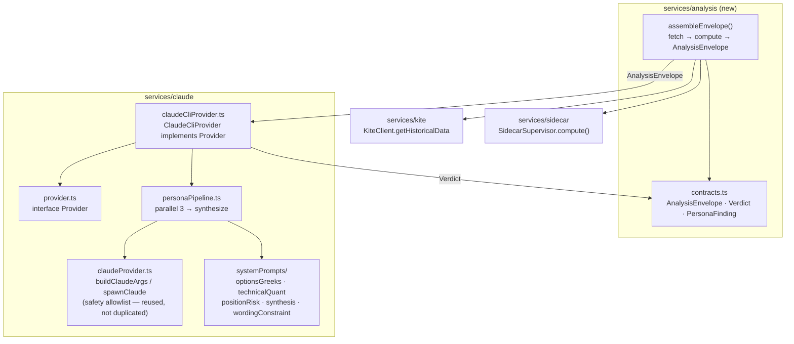

# Phase 4 — Claude AI Integration Design

Status: approved by user 2026-07-24 (brainstorming dialogue), pending implementation planning.
Author: design produced via superpowers:brainstorming, elaborating §7 of `docs/superpowers/specs/2026-07-18-trade-assistant-design.md` (the "AI Reasoning Layer") into an implementable phase.

This spec is an **elaboration of §7**, not a replacement. Section references of the form "§N" point at the master design doc unless prefixed "P4§" (this document). Where a decision here refines or narrows §7's earlier text, it is called out explicitly in P4§11 rather than left to silently diverge.

## P4§1 Purpose

Phase 4 turns the `claude` CLI subprocess scaffolding already built in Phase 3 (`electron-app/src/main/services/claude/claudeProvider.ts`) into a working AI reasoning layer: a `Provider` abstraction (§7.1), a four-stage persona pipeline (§7.2), the prompt construction that feeds it, and — new in this phase — a real, live envelope-assembly path that goes fetch → compute → `AnalysisEnvelope`, so the pipeline can be exercised end-to-end against Phase 1/2/3's actual output rather than only a hand-written fixture.

The phase deliberately folds in three grounding tasks that Phase 4 is the first real caller of, and which cannot be validated without it: widening the sidecar wire protocol so the full `AlgoOutput` reaches TypeScript (§6.1, §6.3), and two leftover bugfixes in the Phase 3 supervisor/archive path (P4§5).

Everything in this phase obeys the master design's single most important constraint (§2, §4): **the app never places, modifies, cancels, or automates an order.** Phase 4 adds a product-level extension of that constraint on *wording* (P4§8): no persona output, and no final `Verdict`, may phrase anything as an imperative trade directive — only descriptive analysis (direction + evidence + confidence).

## P4§2 Scope

**In scope:**

- Wire-protocol widening, Rust + TS, so the full `AlgoOutput` field set and the confluence scorecard cross the sidecar boundary intact (P4§4).
- Two Phase-3 bugfixes whose first real caller is this phase (P4§5): a per-request timeout on `SidecarSupervisor.send()`, and surfacing a swallowed persist failure in `fetchAndArchive`.
- A live envelope-assembly module: fetch → compute → typed `AnalysisEnvelope` (P4§6).
- The `Provider` interface + `ClaudeCliProvider` implementation of the four-stage persona pipeline: three analytical personas run in parallel, one synthesis persona (P4§7).
- Structured-output validation with retry-then-fail, and a per-persona subprocess timeout (P4§7.4, P4§7.5).
- The wording/ethos constraint baked into every persona's system prompt (P4§8), and the system-prompt file layout (P4§9).
- Headless, fixture-driven and mocked-live tests (P4§10).

**Not in scope (Phase 5, per the roadmap's "response modes / chat UI / history"):**

- Any chat UI, streaming renderer, or Engine-Only wizard (§8.3, §9).
- Any cross-run conversational memory or persistent decision-history log (§8.5). The `Provider` interface and `AnalysisEnvelope` are *designed* so Phase 5 can inject prior context into an envelope without a rewrite (the optional `session_id` field, §7.3, is carried through untouched), but **no memory store is built in Phase 4**.
- The deterministic (non-AI) response generator (§9.2). Phase 4 is the AI-Assisted path only.
- Populating the envelope's `overlays` / `news_context` from a real options or news feed. The live compute path is closes-only (P4§6.3); those envelope fields exist and are typed, but are left empty in this phase.

## P4§3 Architecture overview

Phase 4 introduces one new service domain, `services/analysis/`, and fills out the existing `services/claude/` domain, keeping the `services/{sidecar,kite,claude}/` grouping the Phase 3 refactor established.



The data flow for one analysis:

1. `assembleEnvelope()` calls `fetchAndArchive()` (Kite historical fetch + sidecar persist, §10.2 archiving guarantee) then `SidecarSupervisor.compute()`, and packs the widened algorithm results + confluence scorecard + request metadata into a typed `AnalysisEnvelope`.
2. `ClaudeCliProvider.complete(envelope)` runs the three analytical personas as **independent, parallel** one-shot `claude --print` subprocess calls. Each returns a small typed JSON object (`PersonaFinding`) validated against a JSON schema.
3. The synthesis persona runs as a **fourth, independent** call. It receives the three `PersonaFinding` objects explicitly in its own prompt (not via `--resume`/session chaining — every call is stateless) and produces the final `Verdict`.
4. The `Verdict` is returned to the caller. No UI consumes it yet in Phase 4; the DoD is met by a test asserting the `Verdict` cites real `algo_id`s present in the envelope.

The pipeline is a fan-out/fan-in shape, not a sequential chain: "pipeline" in §7.2 is realized here as *parallel analytical stage → synthesis stage*. The three analytical personas share no state and can run concurrently; synthesis depends on all three.

## P4§4 Wire-protocol widening

**Motivation.** The sidecar's live compute response currently drops five of the nine fields `algo-core`'s `AlgoOutput` carries. That was adequate for Phase 3's "prove the stdio round-trip" DoD, but Phase 4 is the first caller that needs the full record: the personas must cite `algo_id`s, reason over `direction`/`magnitude`/`confidence`, and know each result's `timeframe`/`horizon`; and §6.3's non-collapsing guarantee only holds end-to-end if nothing is discarded at the wire.

### P4§4.1 The real current Rust shapes (read, not guessed)

`algo-core`'s `AlgoOutput` (`rust-core/crates/algo-core/src/algorithm.rs`) has nine fields:

| Field | Rust type |
|---|---|
| `algo_id` | `&'static str` |
| `symbol` | `String` |
| `timeframe` | `Timeframe` (`Minute` \| `FiveMinute` \| `FifteenMinute` \| `Day`) |
| `horizon` | `Horizon` (`Intraday` \| `Positional`) |
| `direction` | `Direction` (`Bullish` \| `Bearish` \| `Neutral`) |
| `magnitude` | `f64` |
| `confidence` | `f64` |
| `evidence` | `Vec<String>` |
| `computed_at` | `DateTime<Utc>` |

`algo-core`'s `compute_confluence` (`rust-core/crates/algo-core/src/confluence.rs`) returns a single **flat** `ScorecardSummary`:

| Field | Rust type | Note |
|---|---|---|
| `bullish_count` | `usize` | |
| `bearish_count` | `usize` | |
| `neutral_count` | `usize` | |
| `weighted_vote` | `f64` | `Σ(direction_sign · weight) / Σ(weight)`, roughly `[-1, 1]`; structurally distinct from any per-algo `confidence`. |

Two facts about the confluence layer that the wire design must respect rather than paper over:

- **There is no per-horizon breakdown today.** `compute_confluence` produces one flat scorecard over whatever outputs it is handed, and the sidecar's `handle_request` (`rust-core/crates/sidecar/src/handlers.rs`) currently pins `Horizon::Positional` for the whole request. A genuine per-horizon *subtotal* would be a real `algo-core` change, not a wire-mapping change — see P4§4.3.
- **The weighted vote is equal-weighted today.** `handle_request` passes an empty `HashMap`, so every `weight` defaults to `1.0` (documented in `confluence.rs`'s own doc comment); real rolling-hit-rate weights arrive when Phase 2's backtest engine feeds the sidecar. `weighted_vote` is already the field that carries §6.3's "hit-rate-weighted vote kept distinct from live per-algo confidence" — the *distinctness* is structural and true now; the *hit-rate* content becomes real later, without a wire-shape change.

The current wire types (`rust-core/crates/sidecar/src/protocol.rs`, mirrored in `electron-app/src/main/services/sidecar/sidecarProtocol.ts`):

- `AlgoResultWire`: `{ algo_id, direction, confidence, evidence }` — drops `symbol`, `timeframe`, `horizon`, `magnitude`, `computed_at`.
- `ConfluenceWire`: `{ bullish_count, bearish_count, neutral_count, weighted_vote }` — already a faithful mirror of `ScorecardSummary`.

### P4§4.2 Widened `AlgoResultWire`

Add the five dropped fields so the wire carries all nine `AlgoOutput` fields. Final shape (Rust `serde` / TS mirror, snake_case on the wire to match the bytes, per the existing convention comment in `sidecarProtocol.ts`):

| Wire field | Rust `serde` type | Source on `AlgoOutput` | Serialization note |
|---|---|---|---|
| `algo_id` | `String` | `algo_id` | unchanged |
| `symbol` | `String` | `symbol` | new |
| `timeframe` | `String` | `timeframe` | new; `Timeframe` → the same interval strings `handle_request` already parses (`"minute"`, `"5minute"`, `"15minute"`, `"day"`) |
| `horizon` | `String` | `horizon` | new; `"intraday"` / `"positional"` |
| `direction` | `String` | `direction` | unchanged; keeps the existing `"Bullish"`/`"Bearish"`/`"Neutral"` `Debug` spelling — the TS layer lowercases it when mapping to a `PersonaFinding`/`Verdict` direction (P4§7.2) |
| `magnitude` | `f64` | `magnitude` | new |
| `confidence` | `f64` | `confidence` | unchanged |
| `evidence` | `Vec<String>` | `evidence` | unchanged |
| `computed_at` | `String` | `computed_at` | new; RFC-3339 via `DateTime<Utc>` |

`handle_request`'s `AlgoResultWire` construction gains the five new mappings (`symbol: output.symbol.clone()`, `timeframe: <enum→string>`, `horizon: <enum→string>`, `magnitude: output.magnitude`, `computed_at: output.computed_at.to_rfc3339()`). The TS `AlgoResultWire` interface in `sidecarProtocol.ts` gains the five matching fields (all `string`/`number`). No request-side change: `ComputeRequest` stays closes-only (P4§6.3 explains why the widening is response-side only).

### P4§4.3 `ConfluenceWire` — mirror the real flat scorecard; defer per-horizon

`ConfluenceWire` stays a faithful mirror of the real `ScorecardSummary`: `{ bullish_count, bearish_count, neutral_count, weighted_vote }`. This is deliberate and grounded in the "don't invent wire fields the Rust side has no source for" rule:

- §6.3's **non-collapsing guarantee is fully preserved** by P4§4.2: the widened `AlgoResultWire[]` now carries every algorithm's own `horizon` and `timeframe`, so nothing is discarded and any per-horizon view is reconstructable downstream from the uncollapsed array.
- §6.3's literal "confluence scorecard with **per-horizon breakdown**" is a genuine `algo-core` change (a per-`Horizon` subtotal struct inside `ScorecardSummary`), and it is **degenerate today** because the sidecar pins a single `Horizon` per request. Adding a `by_horizon` field to the wire now — while the Rust side produces one flat scorecard over one pinned horizon — would be exactly the phantom field the grounding rule forbids. It is therefore explicitly deferred to the phase that makes the compute path run more than one horizon per request, at which point it becomes a real `compute_confluence` extension mirrored by a real wire field. This is flagged as a tension with §6.3/§7.3 in P4§11.

`empty_response` (`protocol.rs`) needs no shape change beyond keeping `ConfluenceWire` as-is: it already returns an empty `algo_results` vec (so none of the new per-result fields apply) and a zeroed `ConfluenceWire`.

### P4§4.4 Protocol tests to extend

The existing `protocol_test.rs` / `sidecarSupervisor.test.ts` round-trip fixtures assert the old four-field `AlgoResultWire`. Extend them to assert the five new fields survive encode → decode on both sides, and that a decoded widened `ComputeResponseWire` still routes to the correct pending promise by `id`.

## P4§5 Two folded-in bugfixes

### P4§5.1 `SidecarSupervisor` per-request timeout

**Defect.** `send()` (`electron-app/src/main/services/sidecar/sidecarSupervisor.ts`) registers a `pending` entry and writes the request, but sets no timeout. A dropped or malformed response line is (correctly, since the last PR) logged and skipped in `dispatch()` rather than crashing — but that leaves the caller's promise pending forever and leaks the `pending` map entry. Phase 4 is the first caller that issues compute requests inside a larger orchestration where a silently-hung promise would wedge an entire analysis run.

**Fix.**

- Add `requestTimeoutMs?: number` to `SidecarSupervisorOptions`, default **30000** (compute is fast CPU-bound Rust; the default only guards against a genuinely dropped/never-arriving line).
- In `send()`, after `this.pending.set(id, …)`, start a `setTimeout`. On fire: if the `id` is still in `pending`, delete it and `reject(new Error(\`sidecar request ${id} timed out after ${ms}ms\`))`. Store the timer handle on the `Pending` record (add `timer: NodeJS.Timeout` to the `Pending` interface).
- In `dispatch()`, clear the timer before resolving.
- In `onExit()`, clear every pending entry's timer before the existing reject-all loop, so a later-firing timeout can't settle an already-rejected promise.
- In `stop()`, clear all pending timers.
- The late-response case is already safe: a response arriving after its timeout hits `dispatch()`, finds no `pending` entry, and is dropped (`if (!waiting) return`) — no double-settle.

**Test.** With `requestTimeoutMs` set small and a `FakeChild` (existing DI pattern) that never writes a response line, `compute()` rejects with the timeout error, and the supervisor's `pending` map is empty afterward (proving no leak). Mirrors the existing `sidecarSupervisor.test.ts` fake-child style.

### P4§5.2 `fetchAndArchive` must surface a persist failure

**Defect.** `fetchAndArchive()` (`electron-app/src/main/services/kite/historicalDataArchive.ts`) awaits `sidecar.persistCandles(...)` and returns `persisted: persistResult.written`. The Rust persist handler returns a **resolved** `{ written: 0, error: "…" }` on a storage failure (it does not reject) — so a failed archive is silently returned as if archiving succeeded, violating §10.2's "every live candle it fetches is also written into the Parquet lake, permanently" guarantee.

**Fix.** After awaiting `persistResult`, if `persistResult.error != null`, throw `new Error(\`archiving ${params.symbol} ${params.timeframe} failed: ${persistResult.error}\`)`. As belt-and-suspenders on the same all-or-nothing Rust contract (`written = candles.len()` on success, `written = 0, error = Some(...)` on failure), also throw if `persistResult.written !== candles.length` with no `error` set. The happy path (`error` absent, counts match) returns unchanged.

**Test.** A mocked `sidecar.persistCandles` resolving `{ written: 0, error: "disk full" }` makes `fetchAndArchive` reject; the existing happy-path test (returns `persisted` count, closes) still passes.

## P4§6 Envelope assembly (new)

### P4§6.1 Module & location

**File:** `electron-app/src/main/services/analysis/analysisEnvelope.ts`, with shared contract types in `electron-app/src/main/services/analysis/contracts.ts`.

**Justification.** An analysis envelope is neither a Kite concern nor a sidecar concern nor a Claude concern — it composes all three. A new `services/analysis/` domain matches the existing `services/{sidecar,kite,claude}/` grouping and gives the `AnalysisEnvelope`/`Verdict`/`PersonaFinding` contract types a single home that both the assembler (which produces an envelope) and the provider (which consumes it and produces a `Verdict`) can import without a circular dependency. `provider.ts` in `services/claude/` imports these contract types; nothing in `services/analysis/` imports from `services/claude/`.

### P4§6.2 `AnalysisEnvelope` — realized from §7.3

§7.3 defines `AnalysisEnvelope` with `algo_results: AlgoOutput[]` and `confluence: ScorecardSummary` — Rust type names standing in for their TS wire mirrors. Phase 4 grounds those to the widened wire types from P4§4; this is the intended reading of §7.3, **not** a new field:

```typescript
interface AnalysisEnvelope {
  trigger: "reactive" | "proactive_scan";
  instrument: { symbol: string; exchange: string; segment: string; kite_token_asof: string };
  horizon_requested: "intraday" | "positional" | "auto";
  intent_lens: "buying" | "selling";
  algo_results: AlgoResultWire[];   // §7.3's AlgoOutput[], widened per P4§4.2 — full, uncollapsed
  confluence: ConfluenceWire;       // §7.3's ScorecardSummary (P4§4.3)
  overlays: { oi_buildup?: string; pcr?: number; max_pain?: number; greeks?: object; kronos_forecast?: object };
  position_context?: { qty: number; avg_price: number; pnl: number };
  news_context?: CitedHeadline[];   // Phase 5 only — unpopulated in Phase 4
  session_id?: string;              // Phase 5 memory hook — carried, unused in Phase 4
}
```

No new envelope fields are required for Phase 4. The only refinements are the two type groundings above (`AlgoResultWire[]` / `ConfluenceWire`), which are exactly what §7.3 already means. This is called out in P4§11 for completeness, but it is a grounding, not an extension.

### P4§6.3 `assembleEnvelope()`

```typescript
interface AssembleEnvelopeDeps {
  kite: KiteClient;
  sidecar: Pick<SidecarSupervisor, "compute">;
  // fetchAndArchive is called internally; its deps (kite + sidecar.persistCandles) come from the same instances.
}
interface AssembleEnvelopeParams {
  trigger: "reactive" | "proactive_scan";
  instrument: { symbol: string; exchange: string; segment: string; instrumentToken: string };
  timeframe: string;                 // "minute" | "5minute" | "15minute" | "day"
  horizon_requested: "intraday" | "positional" | "auto";
  intent_lens: "buying" | "selling";
  from: string;
  to: string;
}
async function assembleEnvelope(deps, params): Promise<AnalysisEnvelope>;
```

Behavior:

1. Call `fetchAndArchive({ kite, sidecar }, { symbol, instrumentToken, timeframe, from, to })` — fetches Kite historical candles and archives them (P4§5.2 guarantees a persist failure now throws here rather than passing silently).
2. Call `sidecar.compute(symbol, timeframe, closes)` with the `closes` returned by step 1.
3. Assemble the widened `algo_results` and `confluence` from the `ComputeResponseWire`, plus the request metadata (`trigger`, `instrument` with `kite_token_asof` = the token used, `horizon_requested`, `intent_lens`), into an `AnalysisEnvelope`.
4. `overlays` is emitted as `{}` and `position_context`/`news_context`/`session_id` are left unset in Phase 4 — see below.

**Why the live path is closes-only, and why `overlays` is empty in Phase 4.** The sidecar's `ComputeRequest` carries only `closes`, and `handle_request` builds its `MarketContext` via `from_closes` (empty OHLCV, `None` options/chain/peer/higher-tf) — this is the documented Phase-3 shape ("the live sidecar path has no OHLCV/options feed yet"). The options analytics (`bsm_greeks`, `implied_vol`, `max_pain`, `oi_buildup`, `put_call_ratio`) therefore no-op to `Neutral` and produce no overlay values. Widening the *request* to carry OHLCV + an options-chain context is a separate, larger piece of work (a new compute-request shape and a Kite options-chain fetch) that Phase 4 does not need to meet its DoD, so it is left out. The `overlays` envelope field stays typed and empty; the personas reason over the uncollapsed `algo_results` and the confluence scorecard, which are real.

## P4§7 Provider & persona pipeline

### P4§7.1 `Provider` interface

Unchanged from §7.1:

```typescript
interface Provider {
  complete(envelope: AnalysisEnvelope): Promise<Verdict>;
}
```

**File:** `electron-app/src/main/services/claude/provider.ts`. `ClaudeCliProvider` is the only implementation in v1; nothing upstream depends on Claude specifically (the extension point for future providers, §16).

### P4§7.2 Contract types produced by the pipeline

**`PersonaFinding`** — each analytical persona's small typed output (in `contracts.ts`):

```typescript
interface PersonaFinding {
  persona: "options_greeks" | "technical_quant" | "position_risk";
  direction: "bullish" | "bearish" | "neutral";   // matches algo-core's Direction enum, lowercased
  conviction: "high" | "medium" | "low";           // §7.4 conviction taxonomy; this is the task's "confidence", named to match Verdict
  findings: string[];                              // descriptive statements only (P4§8)
  cited_algo_ids: string[];                        // MUST be a subset of the envelope's algo_ids
}
```

**`Verdict`** — refined from §7.3 (see P4§11 for the flagged change to `direction`):

```typescript
interface Verdict {
  direction: "bullish" | "bearish" | "neutral";    // NOT "sell"|"hold"|"add"|"watch" — see P4§8, P4§11
  conviction: "high" | "medium" | "low";
  reasoning: string;                                // prose; must cite specific algo_ids
  cited_algo_ids: string[];                         // machine-checkable citation list (see below)
  verify_before_acting: string;                     // §7.3 — what the human should check in Kite itself
}
```

`cited_algo_ids` is added to §7.3's four `Verdict` fields (`direction`, `conviction`, `reasoning`, `verify_before_acting`) so the DoD — "the `Verdict` cites specific `algo_id`s" — is *machine-checkable* rather than asserted by brittle substring matching over `reasoning`. The pipeline validates that every id in `cited_algo_ids` is present in the envelope's `algo_results`; a citation of a non-existent id fails the run (P4§7.4). This addition is flagged in P4§11.

### P4§7.3 The four-stage flow

`ClaudeCliProvider.complete(envelope)`:

1. Build three analytical prompts. Each persona's user prompt carries the **full, uncollapsed** `algo_results` array and the `confluence` scorecard (§6.3 — no persona ever sees a pre-filtered subset). The options persona additionally receives `overlays`; the position/risk persona additionally receives `position_context`. Each prompt is paired with its persona's system prompt (P4§9).
2. Run all three via `runPersona()` **in parallel** (`Promise.all`). Each `runPersona()` spawns one `claude --print` subprocess (P4§7.6), reads its JSON output, and validates the `structured_output` against that persona's schema (P4§7.4).
3. If any of the three rejects, kill the other in-flight subprocesses and reject `complete()` — **any one persona failing fails the whole run** (no partial synthesis; P4§7.5).
4. Build the synthesis prompt: it embeds the three `PersonaFinding` JSON objects **explicitly in its own prompt text** (not via `--resume`/`--session-id` — every call is independent and stateless), plus the set of valid `algo_id`s from the envelope so the synthesis can be told which ids it is allowed to cite.
5. Run the synthesis persona as the fourth `runPersona()` call, validate its output against the `Verdict` schema, and assert `cited_algo_ids ⊆ envelope algo_ids`. Return the `Verdict`.

Stages 1–3 are the fan-out; stages 4–5 are the fan-in. The orchestration itself (parallel-then-synthesize, schema validation, retry, kill-siblings-on-failure) lives in `personaPipeline.ts` as pure logic over an injectable persona-runner; `claudeCliProvider.ts` supplies the real runner (spawn + timeout) and implements `Provider`. This split keeps the orchestration unit-testable without a subprocess.

### P4§7.4 Structured output & retry-then-fail

Each `claude` call uses `--json-schema '<schema>' --output-format json` (per §7.1 and `docs/CLAUDE_USAGE_GUIDE.md`). `--json-schema` is best-effort-with-retries at the CLI level, **not** a constrained-decoding guarantee — so a `structured_output`-absent or schema-invalid response is a real, expected failure mode (§7.1), handled here explicitly:

- Parse the subprocess stdout as the CLI's JSON envelope and extract `structured_output`. Validate it with a `zod` schema (already a dependency) that mirrors the persona's `--json-schema`.
- **On validation failure (absent or non-conforming):** retry the call **once**, appending a corrective note to the prompt — the schema plus the concrete validator error, e.g. *"Your previous reply did not match the required JSON schema (`<error>`). Reply with only a JSON object conforming to it."*
- **On a second failure:** throw `new Error(\`persona ${name} failed to produce valid structured output after retry\`)`. The run fails explicitly; it never proceeds on a partial or guessed result — consistent with the app's non-collapsing, never-fabricate ethos (§6.3, §7.4).

The synthesis persona is validated the same way, plus the `cited_algo_ids ⊆ envelope` check (P4§7.2); a citation of an id absent from the envelope is treated as a schema failure and takes the same retry-then-fail path (the corrective note lists the allowed ids).

### P4§7.5 Fail-fast on any persona

Any single persona failing — schema-invalid after retry, subprocess timeout (P4§7.6), or non-zero exit — fails the entire `complete()`. There is no partial synthesis with a missing persona's input: the synthesis persona is only ever given three valid `PersonaFinding`s or the run has already rejected. On the first rejection in the parallel stage, outstanding sibling subprocesses are killed so no orphaned `claude` process is left running.

### P4§7.6 Per-persona subprocess timeout

Each of the four `claude` calls gets its own timeout, **separate from** the sidecar's per-request timeout (P4§5.1): a hung/slow model provider call (network, overload) must not hang the whole analysis run forever.

- `ClaudeCliProvider` takes `personaTimeoutMs?` (default **120000** — model calls are slower and more variable than the sidecar's local compute).
- On timeout, kill the persona's child process and reject that persona (which fails the run per P4§7.5).
- The runner is injectable (`spawnFn`, mirroring `spawnClaude`'s existing default) so tests drive stdout/exit/timing without a real binary.

### P4§7.7 Reusing the Phase-3 safety scaffolding

The persona calls **reuse** `claudeProvider.ts`'s `buildClaudeArgs`/`spawnClaude` and its `KITE_READ_TOOL_ALLOWLIST`/`KITE_WRITE_TOOL_DENYLIST` — this safety-critical allowlist/denylist + `--strict-mcp-config` logic is never duplicated (§4, layer 2). `buildClaudeArgs` is **extended** (not forked) to accept optional persona parameters:

```typescript
buildClaudeArgs(prompt: string, opts?: {
  systemPrompt?: string;                 // → --system-prompt
  jsonSchema?: string;                   // → --json-schema
  outputFormat?: "json" | "text";        // → --output-format
}): string[]
```

The three safety flags (`--allowedTools <read-allowlist>`, `--disallowedTools <write-denylist>`, `--strict-mcp-config`) are emitted **unconditionally, always first**, exactly as today; the optional persona flags are appended when present, and `--print <prompt>` stays last. Called with no `opts`, it returns byte-for-byte the current argv — the existing `claudeProvider.test.ts` assertion (`buildClaudeArgs("analyze INFY")`) still passes unchanged. A test asserts that adding persona options never drops or reorders the three safety flags.

## P4§8 Wording / ethos constraint (critical)

This is a product-level constraint on **wording**, distinct from and *in addition to* the structural safety layers (§4: the `KiteClient` closed method set, the `claude` CLI tool allow/deny lists) that make order execution impossible regardless of what any text says.

**Every `PersonaFinding` and the final `Verdict` must be descriptive analysis only — never an imperative trade directive.** Concretely:

- **Allowed:** a `direction` of `bullish` / `bearish` / `neutral` (matching `algo-core`'s `Direction` enum, exactly as the deterministic algorithm outputs already express themselves); supporting `findings`/`reasoning` that cite specific `algo_id`s; a `conviction` of high/medium/low; a `verify_before_acting` note describing what the human should check in Kite.
- **Forbidden:** any phrasing that instructs an action — "buy X", "sell X", "you should place/exit/add", "enter here", "book profit now", or any equivalent imperative. The human — not the app — decides and acts.

This constraint is stated **explicitly in every one of the four persona system prompts** (P4§9), and it is enforced structurally by the schemas: `direction` is a closed enum of `bullish`/`bearish`/`neutral` on both `PersonaFinding` and `Verdict`, so an imperative "action" value cannot validate. The free-text fields (`findings`, `reasoning`, `verify_before_acting`) carry the constraint by prompt instruction; a test feeds an envelope through the pipeline and asserts the `Verdict.direction` is one of the three descriptive values (never an action verb).

This narrows §1/§7.3's earlier "Claude is allowed to state an actual directional lean (sell / hold / add)" — the tension and its resolution are recorded in P4§11.

## P4§9 System-prompt file layout

**Directory:** `electron-app/src/main/services/claude/systemPrompts/`, one file per persona, matching the roadmap's "one file per persona" note but placed under the `services/claude/` domain rather than the roadmap's stale flat `src/main/systemPrompts/` path (the Phase-3 refactor moved everything into `services/`).

- `optionsGreeks.ts` — options / OI / Greeks reading.
- `technicalQuant.ts` — technical / quant confluence reading.
- `positionRisk.ts` — position / risk framing (uses `position_context` when present).
- `synthesis.ts` — the synthesis persona; instructed to cite specific `algo_id`s from the three `PersonaFinding`s before producing the `Verdict`.
- `wordingConstraint.ts` — the single shared source of the P4§8 wording constraint text, imported by all four so the safety-critical wording is defined once, not copy-pasted (a divergent copy is a latent way for the constraint to rot in one persona).

Each persona file is a `.ts` module (not `.md`) exporting `{ systemPrompt: string; outputSchema: object }` — `.ts` so the prompts and their JSON schemas bundle cleanly with the existing Vite/electron build and can be referenced directly from tests. Each `systemPrompt` states (a) that persona's analytical role, (b) the P4§8 wording constraint (via the shared fragment), and (c) that every claim must trace to a specific `algo_id` (§7.4's mandatory evidence citation), and marks unsourced figures as such rather than estimating them. The prompts themselves are authored with the `prompt-engineer` skill at implementation time, built on the `anthropics/financial-services` reference patterns named in §7.4; this spec fixes their *contract* (role + constraint + schema), not their final wording.

## P4§10 Testing approach

Headless, fixture-driven, DI-based — mirroring the `SidecarSupervisor` / `historicalDataArchive` test patterns already in the repo (an injectable `spawnFn`/fake child; a `KiteClient` built over a mocked `callTool`). **No real `claude` or sidecar binary is invoked in unit tests.**

**Persona pipeline (scripted fixture — the roadmap's original headless DoD):**

- A hand-written `AnalysisEnvelope` fixture (real-looking `algo_results` with known `algo_id`s + a confluence scorecard) drives `ClaudeCliProvider.complete()` through an injectable `spawnFn` that returns scripted `claude` JSON outputs.
- Assert the synthesis `Verdict` cites `algo_id`s that are actually present in the envelope (`cited_algo_ids ⊆ envelope algo_ids`), and that `direction` is one of `bullish`/`bearish`/`neutral` (P4§8).
- Assert a persona whose scripted output fails schema validation triggers the **retry** call, and that a second failure throws `"persona <name> failed to produce valid structured output after retry"` (P4§7.4).
- Assert that one persona failing fails the whole run and leaves no orphaned child (P4§7.5).
- Assert a persona subprocess that never exits is killed and rejected at `personaTimeoutMs` (P4§7.6).

**Live envelope-assembly path (mocked Kite/sidecar — not a real Kite session):**

- `assembleEnvelope()` tested with a mocked `KiteClient` (over a fake `callTool`) and a mocked `SidecarSupervisor` (`compute`/`persistCandles`), exactly as `historicalDataArchive.test.ts` mocks them today. Assert the returned envelope carries the widened `algo_results` and the confluence scorecard, and the correct request metadata.
- Assert the P4§5.2 fix: a persist failure surfaced by the mocked sidecar makes `assembleEnvelope`/`fetchAndArchive` reject rather than return a false success.

**Wire widening & bugfixes:**

- Rust `protocol_test.rs` and TS `sidecarProtocol`/`sidecarSupervisor` round-trip tests extended for the five new `AlgoResultWire` fields (P4§4.4).
- `SidecarSupervisor` timeout test: a never-responding fake child makes `compute()` reject and leaves `pending` empty (P4§5.1).

**Safety-flag regression:** a test asserts the extended `buildClaudeArgs` always emits the three safety flags first, for every persona-option combination (P4§7.7).

## P4§11 Relationship to the existing design (flagged tensions & resolutions)

Per the brainstorming self-review, the points below are where this phase touches or refines §7 (and neighbours). Each is called out rather than silently resolved:

1. **`Verdict.direction` enum — a real tension with §1 and §7.3.** §7.3 types `Verdict.direction` as `"sell" | "hold" | "add" | "watch"`, and §1 explicitly *relaxes* the old prototype's "never say buy/sell/hold" rule to let Claude "state an actual directional lean (sell / hold / add)". The Phase 4 decision (and the project's hard wording constraint, P4§8) **narrows this back**: direction is `bullish`/`bearish`/`neutral` (matching the `Direction` enum), and no output may phrase an imperative trade directive. **Resolution:** follow the Phase 4 decision; it supersedes §7.3's `direction` enum and tightens §1's relaxation. This is the most significant divergence in the phase and is deliberate — the deterministic algorithm outputs are already descriptive-only, and aligning the AI verdict with them keeps a single, consistent, non-directive product voice.

2. **Per-horizon confluence breakdown — §6.3/§7.3 vs. the real Rust shape.** §6.3 describes a "confluence scorecard with per-horizon breakdown"; the real `compute_confluence` produces one flat `ScorecardSummary`, and the sidecar pins a single `Horizon` per request. **Resolution:** mirror the real flat scorecard (P4§4.3) and preserve the non-collapsing guarantee via the widened per-algo array (which carries each result's `horizon`); defer a genuine per-horizon subtotal to the phase that runs multiple horizons per request, since inventing a `by_horizon` wire field now would be a phantom with no Rust source.

3. **`Verdict.cited_algo_ids` — a small addition to §7.3.** Added so the DoD's "cites specific `algo_id`s" is machine-checkable rather than a substring guess. Purely additive; §7.3's four fields are unchanged.

4. **Persona independence vs. §7.1's `--resume`.** §7.1 mentions `--resume`/`--session-id` for query-to-query continuity. Phase 4's four calls are **independent and stateless**; synthesis receives the three findings in-prompt. This is not a contradiction — §7.1's session continuity is for *follow-up queries* (a Phase 5 concern), not for chaining personas *within* one analysis. The optional `session_id` envelope field is carried through untouched as the Phase 5 hook.

5. **`overlays` empty in Phase 4 — consistent with §7.3.** §7.3's `overlays`/`news_context`/`position_context`/`session_id` are all optional; the closes-only live compute path (P4§6.3) simply leaves `overlays`/`news_context` empty, which the optional typing already permits.

## P4§12 File layout summary

New / changed files:

- `rust-core/crates/sidecar/src/protocol.rs` — widen `AlgoResultWire` (P4§4.2).
- `rust-core/crates/sidecar/src/handlers.rs` — populate the five new fields in the `AlgoResultWire` mapping.
- `electron-app/src/main/services/sidecar/sidecarProtocol.ts` — mirror the widened `AlgoResultWire`.
- `electron-app/src/main/services/sidecar/sidecarSupervisor.ts` — per-request timeout (P4§5.1).
- `electron-app/src/main/services/kite/historicalDataArchive.ts` — surface persist failure (P4§5.2).
- `electron-app/src/main/services/analysis/contracts.ts` — `AnalysisEnvelope`, `Verdict`, `PersonaFinding` (new).
- `electron-app/src/main/services/analysis/analysisEnvelope.ts` — `assembleEnvelope()` (new).
- `electron-app/src/main/services/claude/provider.ts` — `Provider` interface (new).
- `electron-app/src/main/services/claude/claudeCliProvider.ts` — `ClaudeCliProvider` (new).
- `electron-app/src/main/services/claude/personaPipeline.ts` — parallel-then-synthesize orchestration (new).
- `electron-app/src/main/services/claude/claudeProvider.ts` — extend `buildClaudeArgs` with persona options (P4§7.7).
- `electron-app/src/main/services/claude/systemPrompts/{optionsGreeks,technicalQuant,positionRisk,synthesis,wordingConstraint}.ts` — persona prompts + schemas (new).
- Tests under `electron-app/test/main/services/{analysis,claude,sidecar}/` and `rust-core/crates/sidecar/tests/` per P4§10.
