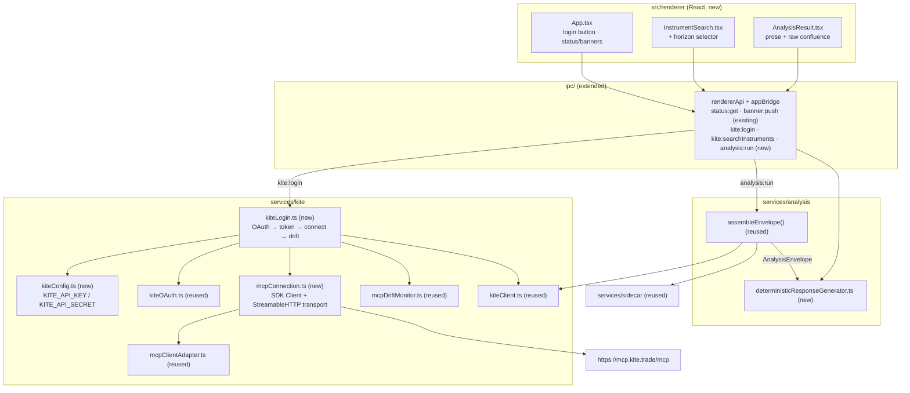

# Phase 5a — Live Wiring + Engine-Only Deterministic Response Design

Status: approved by user 2026-07-25 (brainstorming dialogue), pending implementation planning.
Author: design produced via superpowers:brainstorming, elaborating the Phase 5 section of `docs/superpowers/plans/2026-07-18-implementation-roadmap.md` and §8.2/§8.3/§9 of `docs/superpowers/specs/2026-07-18-trade-assistant-design.md`.

Phase 5 ("response modes / chat UI / history") was judged too large for one plan and decomposed into four sub-phases. This spec covers **only 5a**. Section references of the form "§N" point at the master design doc; "P4§N" points at `docs/superpowers/specs/2026-07-24-phase4-claude-integration-design.md`; "P5a§N" points at this document. Where a decision here narrows or defers something from the master doc or the roadmap, it is called out explicitly in P5a§12 rather than left to silently diverge.

## P5a§1 Purpose

Phase 5a proves the entire Phase 3 (Electron shell, Kite MCP safety layers, sidecar supervision) plus Phase 4 (envelope assembly; Claude is present but **not used** in 5a) stack works end-to-end against the real world, by wiring the first live external connection and the first real frontend this codebase has ever had:

a real Kite OAuth login reachable from the UI → a real live MCP connection to `https://mcp.kite.trade/mcp` → live fetch/compute via the existing `assembleEnvelope` → a new **Engine-Only deterministic response** (templated prose, zero Claude calls) → displayed in a minimal React UI.

This is the first time the codebase connects to a live external service, and the first time it renders anything beyond the status stub. Every already-built Phase 3/4 module that has "never been run for real" — the MCP client adapter (`mcpClientAdapter.ts`), the drift monitor (`mcpDriftMonitor.ts`), the OAuth helpers (`kiteOAuth.ts`) — gets its first real caller here.

Everything in this phase obeys the master design's hard constraint (§2, §4): **the app never places, modifies, cancels, or automates an order.** 5a adds no new Kite method beyond `KiteClient`'s existing closed read-only set, and the deterministic generator (P5a§7) carries the same product-level wording constraint Phase 4 applied to Claude output (P4§8): descriptive analysis only, never an imperative trade directive.

## P5a§2 Scope

**In scope (the five new pieces):**

1. Kite API key/secret config from a gitignored `.env` (`kiteConfig.ts`, P5a§4).
2. A real MCP connection module constructing the `@modelcontextprotocol/sdk` `Client` + `StreamableHTTPClientTransport`, adapted via the existing `mcpClientAdapter.ts` (P5a§5).
3. Login-flow wiring: an IPC-reachable `kite:login` that runs the OAuth → token-exchange → MCP-connect → drift-check → `markAuthenticated` sequence (P5a§6).
4. The Engine-Only `deterministicResponseGenerator.ts` — pure templated prose over `algo_results`/`confluence` (P5a§7).
5. A minimal React UI: login button, instrument search, horizon selector, submit → deterministic prose + raw confluence (P5a§8), with the React/JSX build + component-test tooling it requires (P5a§9).

Plus the IPC-surface extensions those five need (`kite:login`, `kite:searchInstruments`, `analysis:run`), layered onto the existing `status:get`/`banner:push` bridge, not replacing it (P5a§6.3).

**Not in scope (later sub-phases — interfaces are left open, nothing is built):**

- **5b (AI-Assisted mode + streaming chat UI):** no `ClaudeCliProvider` call, no streaming renderer, no markdown/DOMPurify render path, no per-session AI/Engine mode picker, no free-text query intake. The `analysis:run` result is a structured object (not a bare string) so 5b's Claude `Verdict` and a streaming channel slot in without reshaping it (P5a§8.4, P5a§10).
- **5c (session/history SQLite store):** nothing is persisted. The structured analysis payload is display-only; no `sessions`/`messages` tables, no reopen/browse (§8.5).
- **5d (settings window + scan scheduler):** no settings UI, no proactive scanning, no tray-resident scheduler. The dev-only `.env` (P5a§4) is the deliberate stand-in for the credential-entry UI that 5d owns.
- The Engine-Only Q&A wizard's **buying/selling lens** step and its automatic position-context pull (§9.2 steps 1 and 4) are **deferred** — 5a's deterministic path templates over `algo_results`/`confluence`, neither of which reads `intent_lens`, so the lens has no observable effect in this sub-phase (P5a§12, tension 1).

## P5a§3 Architecture overview

5a adds one config module and one MCP-connection module to `services/kite/`, one generator to `services/analysis/`, one login-orchestration module, the IPC extensions, and the `src/renderer/` React tree. No existing module's logic changes; `assembleEnvelope`, `KiteClient`, `kiteOAuth`, `mcpClientAdapter`, `mcpDriftMonitor`, and `SidecarSupervisor` are reused as-is.



Two end-to-end flows:

**Login flow** (`kite:login`): `kiteConfig` supplies key/secret → `captureRequestToken` opens the Kite login URL in the system browser and captures `request_token` on a loopback server → `exchangeAccessToken` POSTs the checksum and returns `access_token` → `connectKiteMcp` builds the real SDK `Client` with the token in a request header and `.connect()`s → the client is adapted to `McpToolCaller`/`ToolListing` and wrapped in a `KiteClient` → `checkKiteToolDrift` runs once and any drift becomes a banner → `sessionState.markAuthenticated()`. The connection and `KiteClient` are built **once** and held for the session, torn down on logout/quit.

**Analysis flow** (`analysis:run`): the UI hands `{ instrument, horizon }` → the handler derives `(timeframe, from, to)` from the horizon (P5a§8.2), calls `assembleEnvelope({ kite, sidecar }, params)` (reused unchanged) → the resulting `AnalysisEnvelope` goes to `generateDeterministicResponse` → the rendered prose + raw `confluence` numbers return to the renderer for display. **Zero Claude/subprocess calls on this path.**

## P5a§4 Kite API key/secret config

**File:** `electron-app/src/main/services/kite/kiteConfig.ts` (new).

**Env var names (settled):** `KITE_API_KEY`, `KITE_API_SECRET`. Optional `KITE_LOGIN_PORT` (default `3000`) for the loopback redirect port, which must match the `redirect_url` registered in the Kite developer console (§8.3; the `kite-mcp-server` reference project uses `localhost:3000/callback`).

**Loading.** Node/Electron does not populate `process.env` from a `.env` file on its own. 5a adds `dotenv` as a **devDependency** and calls `dotenv.config({ path: <electron-app>/.env })` **once at the top of `bootstrap.ts`**, before `createApp` reads config. `dotenv` is dev-tooling-appropriate here: the app is never shipped (§2), 5a is dev-only, and credential entry for a packaged build is 5d's settings window, not this `.env`. (A ~15-line hand-rolled `KEY=VALUE` parser was considered to avoid the dependency; `dotenv` is chosen for correct quoting/escaping handling and because it is the ecosystem standard — one small devDependency in a repo whose only runtime dependency is `zod`.)

**Shape and fail-fast.**

```typescript
export class KiteConfigError extends Error {}
export interface KiteConfig { apiKey: string; apiSecret: string; loginPort: number; }
export function loadKiteConfig(env: NodeJS.ProcessEnv = process.env): KiteConfig;
```

`loadKiteConfig` reads `env.KITE_API_KEY` / `env.KITE_API_SECRET`, and **throws `KiteConfigError` with a clear message** ("KITE_API_KEY is missing — create electron-app/.env from .env.example") if either is absent or empty, rather than silently proceeding. `loginPort` parses `env.KITE_LOGIN_PORT` or defaults to `3000`. It is called once during `createApp` startup so a missing `.env` fails loudly at launch, consistent with the app's never-fabricate posture (§5.1).

The `env` parameter is the DI seam: unit tests pass a fake `env` object (present, missing, empty) and assert the parsed config or the thrown `KiteConfigError` — no file or `dotenv` touched in tests. The secret lives only in the main process; it is never read via Vite's `import.meta.env` and never reaches the renderer (§8.2).

**.gitignore.** Add `.env` to `electron-app/.gitignore` (currently `node_modules/`, `dist/`, `out/`). Confirmed: `git ls-files` shows no `.env`-family file is tracked anywhere, so nothing conflicts. A committed `electron-app/.env.example` documents the two variable names with placeholder values.

## P5a§5 Real MCP connection

**File:** `electron-app/src/main/services/kite/mcpConnection.ts` (new).

This is the module that turns the design's "the MCP TS SDK has mature Streamable-HTTP client support" (§3) into a live connection, and gives `mcpClientAdapter.ts` (built in Phase 3, never used until now) its first caller.

**SDK shapes (read from `node_modules`, not guessed).** `@modelcontextprotocol/sdk@1.12.0` (already a devDependency):

- `StreamableHTTPClientTransport` constructor is `(url: URL, opts?: StreamableHTTPClientTransportOptions)`; `opts.requestInit?: RequestInit` — so the access token is injected as `opts.requestInit.headers`.
- `Client` constructor is `(clientInfo: { name, version }, options?)`; it exposes `connect(transport)`, `close(): Promise<void>` (via `Protocol`), `callTool({ name, arguments })`, and `listTools()` returning `{ tools: { name }[] }`.
- The real `Client` therefore already satisfies the adapter's structural `SdkCallClient` / `SdkListClient` interfaces — `toToolCaller(client)` and `toToolListing(client)` accept it directly, no shim.

**Interface.**

```typescript
export interface McpConnection {
  caller: McpToolCaller;   // from mcpClientAdapter.toToolCaller
  listing: ToolListing;    // from mcpClientAdapter.toToolListing
  close(): Promise<void>;  // tears down the SDK client/transport
}

export interface ConnectKiteMcpDeps {
  apiKey: string;
  accessToken: string;
  url?: string;            // default "https://mcp.kite.trade/mcp"
  createClient?: (params: {
    url: string;
    headers: Record<string, string>;
  }) => Promise<{
    callTool(a: { name: string; arguments: Record<string, unknown> }): Promise<unknown>;
    listTools(): Promise<{ tools: { name: string }[] }>;
    close(): Promise<void>;
  }>;
}

export async function connectKiteMcp(deps: ConnectKiteMcpDeps): Promise<McpConnection>;
```

**Behavior.** With the default `createClient`, `connectKiteMcp` builds `new StreamableHTTPClientTransport(new URL(url), { requestInit: { headers } })` and `new Client({ name: "trade-assistant", version: <app version> }, {})`, `await client.connect(transport)`, then returns `{ caller: toToolCaller(client), listing: toToolListing(client), close: () => client.close() }`. The header is `{ Authorization: \`token ${apiKey}:${accessToken}\` }` — the documented Kite Connect REST convention (§5.1). Constructed **once** per session and reused; `close()` is called on logout/app-quit.

> **Flagged (P5a§12, tension 2):** the exact header the hosted `mcp.kite.trade` server accepts for a Kite Connect `access_token` is **not documented** and cannot be verified without a live paid session (the hosted server also exposes its own `login` tool with a browser OAuth dance). `Authorization: token api_key:access_token` is the REST convention and the design's stated approach; confirming the hosted MCP honors it is a manual-verification item (P5a§11), not an automatable one.

**Testing seam.** `createClient` is the injection point: the default constructs the real SDK objects (the un-mockable `.connect()` against the live server is exercised only in manual verification); unit tests pass a fake `createClient` returning a scripted stub, and assert `connectKiteMcp` (a) passes the `Authorization` header through, (b) adapts `callTool`/`listTools` into working `McpToolCaller`/`ToolListing` values, and (c) `close()` forwards to the client. No network in automated tests.

## P5a§6 Login-flow wiring

### P5a§6.1 Orchestration module

**File:** `electron-app/src/main/services/kite/kiteLogin.ts` (new). Pure orchestration over injected effects, mirroring the repo's DI test patterns (`kiteOAuth.ts`, `SidecarSupervisor`).

```typescript
export interface KiteLoginDeps {
  config: KiteConfig;
  captureRequestToken: typeof captureRequestToken;   // reused from kiteOAuth.ts
  exchangeAccessToken: typeof exchangeAccessToken;    // reused from kiteOAuth.ts
  postForm: (url: string, form: Record<string, string>) => Promise<unknown>;
  openExternal: (url: string) => void;                // shell.openExternal
  connectMcp: (d: ConnectKiteMcpDeps) => Promise<McpConnection>; // default connectKiteMcp
  checkDrift: (listing: ToolListing) => Promise<DriftResult>;    // default checkKiteToolDrift
}

export interface KiteSession {
  kite: KiteClient;
  connection: McpConnection;
  drift: DriftResult;
  close(): Promise<void>;
}

export async function runKiteLogin(deps: KiteLoginDeps): Promise<KiteSession>;
```

**Sequence.**

1. Build the Kite login URL from the API key per the documented format: `https://kite.zerodha.com/connect/login?api_key=<apiKey>&v=3`.
2. `requestToken = await captureRequestToken({ port: config.loginPort, loginUrl, openExternal })` — reused unchanged; it starts the loopback server, opens the system browser, and resolves with the captured `request_token` (§8.3).
3. `tokenResponse = await exchangeAccessToken({ apiKey, apiSecret, requestToken, postForm })` — reused unchanged. Extract `access_token` from `tokenResponse.data.access_token`; a missing/malformed response throws a clear error.
4. `connection = await connectMcp({ apiKey, accessToken })` (P5a§5).
5. `kite = new KiteClient(connection.caller)`.
6. `drift = await checkDrift(connection.listing)` — the **first-ever live run** of `checkKiteToolDrift` (§4 layer 3; Phase 3 could only test it against fixtures). This runs right after connect.
7. Return `{ kite, connection, drift, close: connection.close }`.

`postForm` (the real one wired in `bootstrap.ts`) is built on Electron 33's global `fetch`: form-encoded body via `URLSearchParams`, header `X-Kite-Version: 3`, returning parsed JSON — injected so tests never hit the network.

### P5a§6.2 Bootstrap integration & state surfacing

`bootstrap.ts` holds the live session as nullable module state (`let session: KiteSession | null`). On the `kite:login` IPC call it invokes `runKiteLogin` with the real deps, and on success:

- stores `session`;
- if `session.drift.hasDrift`, sets `driftWarning` (already surfaced by `status:get`) and pushes a `BannerEvent { kind: "mcpDrift", message: <added/removed tools> }` through the existing `bannerHandlers` mechanism (`BannerKind` already includes `"mcpDrift"`);
- calls `sessionState.markAuthenticated()` (reused; flips `AppStatus.kiteSession` to `"authenticated"` and the status line updates);
- returns a success result to the renderer.

On failure (`KiteConfigError`, capture/exchange error, connect error) it calls `sessionState.markNeedsLogin()` (reused; emits the existing "Kite needs login today." `kiteLogin` banner) and returns a typed error result the button can render. On `window-all-closed`/quit, `session?.close()` tears down the MCP connection alongside the existing `supervisor.stop()`.

`createApp` calls `loadKiteConfig()` (P5a§4) during startup — before `start()` opens any window — so a missing `.env` fails loudly at launch.

### P5a§6.3 IPC channels

Extends the existing bridge (`ipc/rendererApi.ts` + `ipc/appBridge.ts`), does not replace it. Three `ipcMain.handle` channels are added:

| Channel | Args | Returns |
|---|---|---|
| `kite:login` | — | `{ status: "authenticated" } \| { status: "error"; message: string }` |
| `kite:searchInstruments` | `{ query: string }` | `KiteClient.searchInstruments(query)` result (raw Kite payload) |
| `analysis:run` | `{ instrument: { symbol; exchange; segment; instrumentToken }; horizon: "intraday" \| "positional" }` | `AnalysisResult` (P5a§8.4) |

(`analysis:run`'s `instrument` is the `AssembleEnvelopeParams.instrument` shape — `{ symbol, exchange, segment, instrumentToken }` — built from the selected `kite:searchInstruments` result; `assembleEnvelope` maps its `instrumentToken` to the envelope's `kite_token_asof`.)

`kite:searchInstruments` and `analysis:run` reject with a clear error if `session` is null (not logged in). `RendererApi` (in `rendererApi.ts`) gains `login()`, `searchInstruments(query)`, and `runAnalysis(params)` methods built over the same `invoke` wrapper `getStatus` already uses, so the preload's single `tradeAssistant` bridge object grows three methods and exposes no raw `ipcRenderer` (§8.2). A new `ipc/analysisBridge.ts` registers the three handlers (keeping `appBridge.ts` focused on status/banner per the small-focused-files convention), wired from `createApp` next to `registerStatusBridge`.

## P5a§7 Engine-Only deterministic response generator

**File:** `electron-app/src/main/services/analysis/deterministicResponseGenerator.ts` (new). Pure logic, no I/O, no subprocess — string templating over already-computed data. This realizes §9.2's `DeterministicResponseGenerator` for 5a.

```typescript
export interface DeterministicResponse {
  direction: Direction;          // "bullish" | "bearish" | "neutral" (contracts.ts)
  conviction: Conviction;        // "high" | "medium" | "low"
  text: string;                  // rendered prose (concise or full)
  confluence: ConfluenceWire;    // raw counts + weighted_vote, passed through for display
}

export function generateDeterministicResponse(
  envelope: AnalysisEnvelope,
  opts?: { variant?: "concise" | "full" },   // default "concise"
): DeterministicResponse;
```

**Templating rules (concrete, to avoid ambiguity):**

- **Direction** from `confluence.weighted_vote` (§9.2 "direction comes from the scorecard's weighted vote"): `> 0.05 → bullish`, `< -0.05 → bearish`, else `neutral`. The `±0.05` deadband keeps a near-zero vote honestly neutral.
- **Conviction** from the vote's **agreement ratio** (§9.2 "conviction from the vote's agreement ratio/strength, not a self-reported LLM confidence"): let `total = bullish_count + bearish_count + neutral_count` and `dominant = max(...)`; ratio `≥ 0.66 → high`, `≥ 0.5 → medium`, else `low` (`total === 0 → low`). This is explicitly the count agreement, **not** any per-algo `confidence` field.
- **Per-algorithm lines.** Concise: the top few contributors by `|magnitude|` (ties broken by `confidence`), e.g. `"RSI reads a bullish signal (confidence 0.71): <evidence joined with '; '>"`. Full (the §7.4 concise/full mirror): one line for **every** `algo_results` entry. Direction words are normalized to lowercase `bullish`/`bearish`/`neutral` (the wire carries Rust `Debug` casing `"Bullish"`, per P4§4.2).
- **Confluence summary line:** the raw counts and weighted vote, e.g. `"Confluence: 4 bullish / 1 bearish / 0 neutral, weighted vote +0.62."`
- **Closing line:** the same "verify before acting in Kite yourself" boilerplate every mode shows (§9.2), matching Phase 4's `Verdict.verify_before_acting` intent.

Because the numbers and which algorithms are cited are entirely driven by the real `AnalysisEnvelope`, the output is never canned regardless of input, even though the surrounding words are fixed fragments (§9.2).

**Wording ethos — descriptive only, never a directive (product-consistency decision, stated explicitly).** Every fragment this generator emits is descriptive: a direction (`bullish`/`bearish`/`neutral`), the evidence behind it, and a conviction. **No fragment is ever an imperative trade directive** — no "buy", "sell", "hold", "add", "reduce", "book", "exit", "enter", "watch", or equivalent. This is the **same wording ethos Phase 4 imposed on Claude output** (P4§8), applied here for the same reason and stated as a first-class product decision, not merely a Claude-specific safety concern: both response modes must present the same way (§1, §9), so a user reading an Engine-Only summary and an AI-Assisted verdict sees one consistent, non-directive voice. It is enforced structurally by the closed `Direction`/`Conviction` enums on `DeterministicResponse`, and by prose templates that contain no imperative verbs; a unit test asserts the rendered `text` contains none of an imperative-token denylist for representative envelopes (bullish-heavy, bearish-heavy, split). This mirrors §13's response-mode-parity intent.

## P5a§8 Minimal React UI

**Location:** `electron-app/src/renderer/` — the existing `status.ts` stub is replaced by a small React tree. This is the first frontend framework in the codebase.

### P5a§8.1 Components

- `main.tsx` — entry; mounts `<App/>` into `#root`.
- `App.tsx` — root. Subscribes to `getStatus()` + `onBanner()` (reused IPC), renders the status line and banner list (porting `status.ts`'s current behavior into React), a **Login button**, and — once `status.kiteSession === "authenticated"` — the analysis form. The login button calls `api.login()` and reflects `needsLogin` / loading / `authenticated` via the returned result plus the existing status/banner stream (no new state machine invented).
- `InstrumentSearch.tsx` — a text input that calls `api.searchInstruments(query)` (debounced), lists results, and lets the user select one; plus a **horizon selector** (radio/select: `intraday` | `positional`) and a **Submit** button.
- `AnalysisResult.tsx` — renders the returned `text` (as plain text) and the raw `confluence` numbers (counts + weighted vote).

Deliberately minimal per the roadmap: **no** chat history, **no** message list, **no** markdown/Mermaid/tables, **no** styling system beyond a small external stylesheet for basic layout, **no** persistence.

### P5a§8.2 Horizon → fetch parameters

`assembleEnvelope` takes a concrete `timeframe` + `from`/`to` + `instrumentToken` (its signature is reused unchanged), so the `analysis:run` handler maps the UI's horizon to fetch parameters:

- `intraday → timeframe "5minute"`, `from` = a recent short window (e.g. last few sessions), `to` = now.
- `positional → timeframe "day"`, `from` = a longer window (e.g. ~1–2 years, within `INTERVAL_LOOKBACK_HINT_DAYS.day`), `to` = now.

The exact window sizes are an implementation detail bounded by `historicalDataArchive.ts`'s `INTERVAL_LOOKBACK_HINT_DAYS` (still an unverified hint per §14 item 2). The design doc's third horizon value `auto` (§9.2 step 3) is **not offered** in 5a's two-option selector — the task scope is intraday/positional, and `auto` (letting multi-timeframe confluence decide) is a Phase 2/multi-horizon concern the current single-horizon compute path can't honor yet (P5a§12, tension 3). `instrumentToken`, `exchange`, and `segment` come from the selected search result.

### P5a§8.3 CSP & security

The renderer keeps §8.2's strict production CSP (`default-src 'none'; script-src 'self'; object-src 'none'`). React runs cleanly under `script-src 'self'`: the bundle is a self-hosted module script and React does not `eval`. To style without introducing `'unsafe-inline'`, 5a ships an **external stylesheet** (`style-src 'self'`) rather than inline `style={{…}}` props, and the production CSP in `index.html` gains a `style-src 'self'` directive (the dev CSP in `electron.vite.config.ts` already allows `'unsafe-inline'` for HMR only). No `dangerouslySetInnerHTML` is used anywhere; React's default text-node escaping neutralizes any injection in the rendered `text`/evidence strings, so **no markdown parser and no DOMPurify are needed in 5a** — those arrive with the markdown/streaming render path in 5b, where §8.2's DOMPurify requirement (which attaches specifically to *markdown* rendering) and §13's DeepChat-CVE payload test become live (P5a§12, tension 4). All Kite/network I/O stays in the main process; the renderer reaches Kite only through the three `invoke` channels (§8.2).

### P5a§8.4 Result contract (kept open for 5b/5c)

```typescript
export interface AnalysisResult {
  mode: "engine_only";               // discriminator; 5b adds "ai_assisted"
  instrument: InstrumentRef;
  horizon: "intraday" | "positional";
  response: DeterministicResponse;   // P5a§7 — prose + direction/conviction + confluence
  algo_results: AlgoResultWire[];    // full, uncollapsed (§6.3) — display + 5c payload hook
}
```

Returning a structured object (not a bare prose string) is the deliberate open seam: 5b can add an `ai_assisted` variant carrying a `Verdict` without reshaping the channel, 5c can persist `algo_results` + `response` as its `messages.structured_payload`, and a future streaming channel is additive (P5a§10). 5a itself only displays `response.text` and `response.confluence`.

## P5a§9 React & testing tooling choices

**New dependencies.**

- Runtime (`dependencies`): `react`, `react-dom`.
- Dev (`devDependencies`): `@types/react`, `@types/react-dom`, `@vitejs/plugin-react`, `@testing-library/react`, `@testing-library/dom`, `jsdom`, and `dotenv` (P5a§4).

**Build/config changes.**

- `electron.vite.config.ts` renderer `plugins` gains `react()` (`@vitejs/plugin-react`) — automatic JSX runtime (components need not import React) and dev Fast Refresh.
- `tsconfig.json` `compilerOptions` gains `"jsx": "react-jsx"`.
- `electron.vite.config.ts` renderer input stays `src/renderer/index.html`; `index.html` swaps `#status`/`status.ts` for `#root`/`main.tsx`.

**Testing tooling — choice + justification.** The repo has no React test tooling yet (none existed before 5a), so 5a proposes a minimal, standard stack:

- **`@testing-library/react` + `jsdom`** for component tests. Rationale: it is the de-facto React testing standard, plugs into the existing **Vitest** runner with no new test framework, and its behavior-first API (assert what the user sees, query by role/text) matches this repo's established DI/behavior-focused test ethos (the `spawnFn`/`callTool` mock patterns) rather than testing component internals.
- The repo's `vitest.config.ts` sets a global `environment: "node"` (correct for the main-process tests). Component tests opt into the DOM per-file via a `// @vitest-environment jsdom` docblock, so the node default is untouched and only `.tsx` component tests get a DOM — no config split. `vitest.config.ts` adds `plugins: [react()]` so Vitest applies the same JSX transform as the build.
- Component tests mock the `window.tradeAssistant` bridge (an object with stubbed `getStatus`/`onBanner`/`login`/`searchInstruments`/`runAnalysis`), exactly the DI style used elsewhere — no Electron, no real IPC, no network. Assertions: the login button calls `login()` and reflects `authenticated`; the form calls `searchInstruments`/`runAnalysis` with the selected instrument + horizon and renders the returned prose + confluence.

## P5a§10 Testing approach

Headless, DI-based, mocked — same bar as Phase 3/4. **No real Kite session and no real network in automated tests.** Every new module has an injectable seam:

- **`kiteConfig.ts`:** `loadKiteConfig(fakeEnv)` returns config for a populated env and throws `KiteConfigError` for missing/empty `KITE_API_KEY`/`KITE_API_SECRET`.
- **`mcpConnection.ts`:** a fake `createClient` verifies the `Authorization` header is passed through, that `callTool`/`listTools` are adapted into working `McpToolCaller`/`ToolListing`, and that `close()` forwards.
- **`kiteLogin.ts`:** injected `captureRequestToken`/`exchangeAccessToken`/`postForm`/`openExternal`/`connectMcp`/`checkDrift` (all fakes) drive the full sequence; assert it returns a `KiteClient` over the fake connection, that a drift result surfaces, and that a token-exchange failure rejects with a clear error. Mirrors `kiteOAuth.test.ts`.
- **`deterministicResponseGenerator.ts`:** fixture envelopes (bullish-heavy, bearish-heavy, split, empty) assert the mapped `direction`/`conviction`, that concise vs full vary line count, that cited algorithms appear, and — the wording-ethos guard — that `text` contains no imperative-directive token.
- **`analysis:run` handler:** mocked `KiteClient` + mocked `SidecarSupervisor` (as `historicalDataArchive.test.ts`/`analysisEnvelope.test.ts` already do) assert horizon → `(timeframe, from, to)` mapping and that the structured `AnalysisResult` is assembled and generated; a null session rejects.
- **React components:** per P5a§9, `@testing-library/react` + jsdom over a mocked bridge.
- **End-to-end (extended):** the existing `endToEnd.integration.test.ts` (recorded Kite payload → real sidecar binary → compute) is extended to also run the deterministic generator over the assembled envelope, asserting non-directive prose + a numeric weighted vote — still no live Kite, still `describe.skipIf(!existsSync(SIDECAR))`.

## P5a§11 Manual verification checklist

Mirrors Phase 3's Task 10 §13 pattern: an automatable golden path, plus **live-Kite follow-ups that can only be run when a paid Kite Connect session is available** — a checklist item, never a blocker for calling 5a done.

**Automatable golden path (run once via `npm start` + component tests):**

- Window opens with `contextIsolation`/`sandbox` on (`window.tradeAssistant` exists; `window.require`/`window.ipcRenderer` are `undefined`).
- Status line renders; the Login button is present; before login, the analysis form is hidden.
- With a mocked bridge, submitting the form renders deterministic prose + confluence numbers.

**Live-Kite follow-ups (only with a real paid Kite Connect account):**

- Click **Login** → confirm the loopback + system-browser OAuth flow: the real system browser opens the Kite login URL, redirects to `http://127.0.0.1:<port>/…`, the `request_token` is captured, the "you can close this tab" page shows.
- Confirm `exchangeAccessToken` returns a real `access_token` from `/session/token`.
- Confirm `connectKiteMcp` connects to `https://mcp.kite.trade/mcp` and that **the `Authorization: token api_key:access_token` header is actually honored** by the hosted server (P5a§5 / P5a§12 tension 2) — if it is not, record what the hosted MCP actually expects (e.g. the server's own `login`-tool OAuth), as this is the one integration detail 5a cannot verify offline.
- Run `checkKiteToolDrift` against the **live** `tools/list`; record any tool names beyond `EXPECTED_KITE_TOOLS` and pin them into that baseline (feeds Phase 3 Task 5 Step 6's "pin the live baseline" step) — the first real execution of layer-3 drift detection.
- Search a real instrument, run an analysis for both horizons, confirm the prose + confluence render from live data.
- Confirm daily-token expiry (~6 AM next day, §5.1): a stale session surfaces the "Kite needs login today." banner and re-login restores it.

## P5a§12 Relationship to the existing design (flagged tensions & resolutions)

Per the brainstorming self-review, the points below are where 5a narrows, defers, or refines the master doc / roadmap. Each is called out rather than silently resolved.

1. **Engine-Only wizard's buying/selling lens deferred — tension with §9.2 and the roadmap.** §9.2 makes "Buying or selling?" the wizard's **step 1** (the `intent_lens` field), and the roadmap's Phase 5 lists "buying/selling lens" as part of Engine-Only intake. 5a's UI collects **only instrument + horizon** (per the agreed scope), so the lens step and its dependent step 4 (auto-pulling position context for a "selling" held position) are **deferred**. **Resolution:** this is deliberate and defensible for 5a because the deterministic generator (P5a§7) templates purely over `algo_results`/`confluence`, and **neither reads `intent_lens`** — the lens has no observable effect on Engine-Only output in this sub-phase. `assembleEnvelope`'s `AssembleEnvelopeParams.intent_lens` is a **required** field, so the `analysis:run` handler passes a fixed placeholder `intent_lens: "buying"` purely to satisfy the type; the value flows into the envelope but is never used by 5a's path. The full lens step (which becomes meaningful once a mode frames its reasoning by it) belongs with the AI-Assisted persona reasoning (5b) and/or a later fuller wizard. Flagged so the deferral is explicit, not an accidental omission.

2. **Hosted-MCP token-injection method is unverified — assumption to confirm live.** The master doc (§8.3) describes the OAuth flow producing an `access_token` but does not specify how that token reaches the MCP connection, and the hosted server also exposes its own `login` tool (§5.1). 5a's agreed design injects the Kite `access_token` via an `Authorization` request header (P5a§5). **Resolution:** proceed with the header approach as designed, but treat "does `mcp.kite.trade` honor `Authorization: token api_key:access_token`?" as a manual-verification item (P5a§11) — it is undocumented and unverifiable without a live paid session, consistent with the design's overall "confirm the live MCP surface empirically" posture (§4).

3. **`auto` horizon not offered in 5a — narrowing of §9.2 step 3.** §9.2 lists `intraday | positional | auto`. 5a offers only `intraday | positional`. **Resolution:** `auto` (let multi-timeframe confluence decide) presupposes a multi-horizon compute path; the current sidecar pins a single horizon per request (P4§4.1/P4§4.3), so `auto` has nothing to resolve yet. Deferred to the phase that runs more than one horizon per request; the two-option selector is a strict subset, not a contradiction.

4. **No DOMPurify/markdown render in 5a — consistent with §8.2's scoping.** §8.2 mandates DOMPurify on rendered **markdown** (and §13 tests it with the DeepChat CVE payload). 5a renders the deterministic `text` as plain, React-escaped text nodes with no markdown parser and no `dangerouslySetInnerHTML`, so there is no HTML-injection surface to sanitize yet. **Resolution:** DOMPurify and the CVE-shape test arrive with 5b's markdown/streaming renderer, which is the render path §8.2's requirement actually attaches to. 5a introduces no `'unsafe-inline'` (external stylesheet, P5a§8.3), so the strict CSP is preserved. Flagged so this is a scoped deferral, not a dropped safety requirement.

5. **No per-session AI/Engine-Only mode picker in 5a — deferred with 5b.** §8.3/§9 mandate a per-session mode choice "before anything else." 5a ships **only** the Engine-Only path (AI-Assisted is 5b), so a mandatory choice between two modes is not yet meaningful. **Resolution:** 5a is implicitly Engine-Only; the mandatory picker is introduced in 5b when a second mode exists to choose between. The `AnalysisResult.mode` discriminator (P5a§8.4) is the seam that keeps this open.

## P5a§13 File layout summary

New / changed files:

- `electron-app/src/main/services/kite/kiteConfig.ts` — `loadKiteConfig` + `KiteConfigError` (new).
- `electron-app/src/main/services/kite/mcpConnection.ts` — `connectKiteMcp` over the SDK `Client`/`StreamableHTTPClientTransport`, adapted via `mcpClientAdapter.ts` (new).
- `electron-app/src/main/services/kite/kiteLogin.ts` — `runKiteLogin` orchestration (new).
- `electron-app/src/main/services/analysis/deterministicResponseGenerator.ts` — Engine-Only templated prose (new).
- `electron-app/src/main/ipc/analysisBridge.ts` — registers `kite:login`, `kite:searchInstruments`, `analysis:run` (new).
- `electron-app/src/main/ipc/rendererApi.ts` — add `login`/`searchInstruments`/`runAnalysis` to `RendererApi` and `buildRendererApi` (changed).
- `electron-app/src/main/bootstrap.ts` — load config at startup, hold the live `KiteSession`, wire `kite:login`, tear down on quit (changed).
- `electron-app/src/renderer/main.tsx`, `App.tsx`, `InstrumentSearch.tsx`, `AnalysisResult.tsx`, plus a small stylesheet — minimal React UI (new); `src/renderer/status.ts` removed.
- `electron-app/src/renderer/index.html` — `#root` + `main.tsx`, `style-src 'self'` added to the CSP (changed).
- `electron-app/electron.vite.config.ts` — `react()` in renderer plugins (changed).
- `electron-app/vitest.config.ts` — `react()` plugin for `.tsx` transform (changed).
- `electron-app/tsconfig.json` — `"jsx": "react-jsx"` (changed).
- `electron-app/package.json` — add `react`/`react-dom` (deps) and `@types/react`/`@types/react-dom`/`@vitejs/plugin-react`/`@testing-library/react`/`@testing-library/dom`/`jsdom`/`dotenv` (devDeps) (changed).
- `electron-app/.gitignore` — add `.env` (changed); `electron-app/.env.example` documenting `KITE_API_KEY`/`KITE_API_SECRET`/`KITE_LOGIN_PORT` (new).
- Tests under `electron-app/test/main/services/{kite,analysis}/`, `electron-app/test/main/ipc/`, and `electron-app/test/renderer/` per P5a§10 (new); `endToEnd.integration.test.ts` extended.
